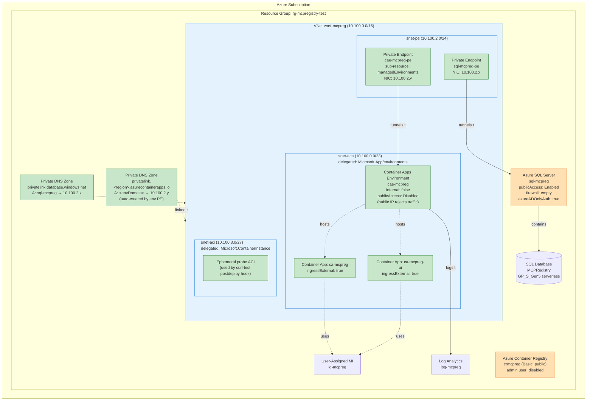
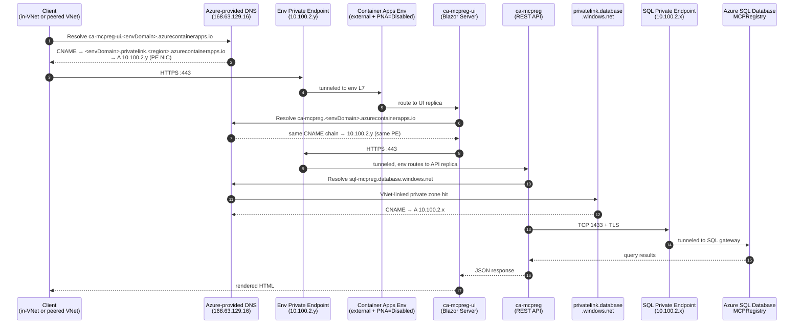
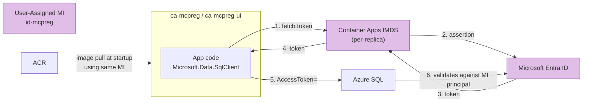
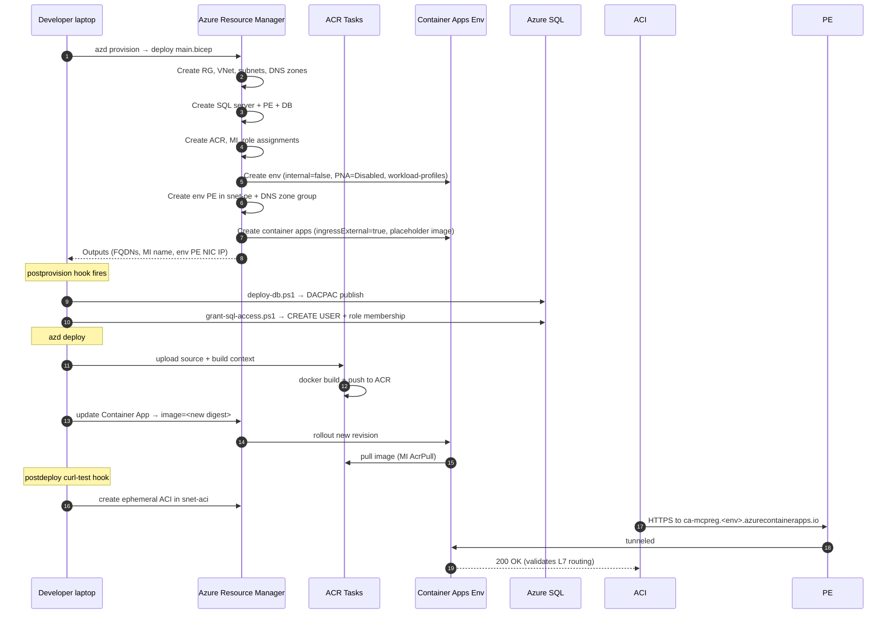
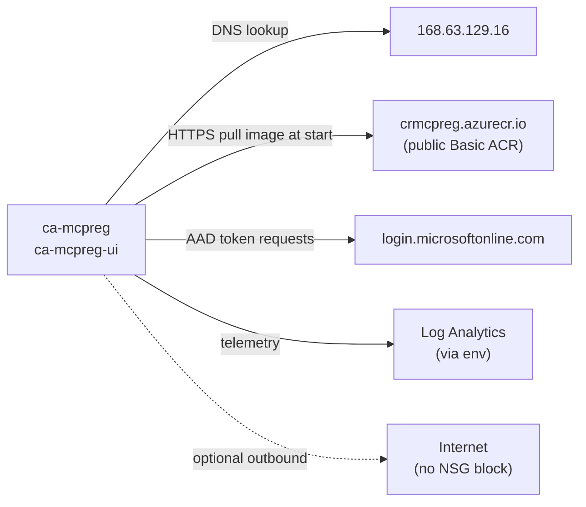

# MCP Registry — Architecture (Option A: External env + PNA=Disabled + Private Endpoint)

> **Why this exists.** Our original lockdown used `internal: true` on the Container Apps environment. That path is blocked by an open Microsoft platform bug ([microsoft/azure-container-apps#1714](https://github.com/microsoft/azure-container-apps/issues/1714)) where the internal load balancer returns `404 Container App is stopped or does not exist` for healthy replicas, even with Microsoft's own hello-world sample. Option A keeps the same privacy posture (no public ingress to the app) by switching to Microsoft's documented **fully-private** pattern: an external env whose public IP is gated by `publicNetworkAccess: Disabled`, reachable only through a **Private Endpoint** on the `managedEnvironments` sub-resource.

---

## Design goals

- **No public ingress to the application.** Ingress reaches the apps only through a Private Endpoint inside the VNet (or a future peered network).
- **No public data plane to the database.** Application → SQL traffic flows over a private endpoint inside the VNet.
- **No SQL passwords anywhere.** All authentication is Microsoft Entra ID (`disableLocalAuth: true`, `azureADOnlyAuthentication: true`). The application uses a user-assigned managed identity.
- **Operator-friendly.** DACPAC and SQL grant scripts continue to work from a developer laptop without a VPN.
- **Workload Profiles environment** (required because Private Endpoint on Container Apps env requires Workload Profiles).

---

## Resource inventory & lockdown state

| Resource | Type | Public access | Notes |
|---|---|---|---|
| `vnet-mcpreg-<suffix>` | Virtual Network (10.100.0.0/16) | n/a | Subnets: `snet-aca` (10.100.0.0/23, delegated `Microsoft.App/environments`), `snet-pe` (10.100.2.0/24), `snet-aci` (10.100.3.0/27, delegated `Microsoft.ContainerInstance/containerGroups`) |
| `cae-mcpreg-<suffix>` | Container Apps Environment | **Disabled** (PE-only) | `internal: false`, `publicNetworkAccess: Disabled`, `workloadProfiles: [Consumption]`, `infrastructureSubnetResourceId = snet-aca` |
| `cae-mcpreg-<suffix>-pe` | Private Endpoint | n/a | In `snet-pe`; targets the env's `managedEnvironments` sub-resource |
| `ca-mcpreg-<suffix>` | Container App (API) | **PE-only** | `ingressExternal: true` (env is external — required), but the env's public IP rejects everything; only PE-sourced traffic reaches the L7 |
| `ca-mcpreg-ui-<suffix>` | Container App (UI) | **PE-only** | Same as above |
| `sql-mcpreg-<suffix>` | Azure SQL Server | **Enabled (firewall = empty)** | Private endpoint `sql-mcpreg-<suffix>-pe` in `snet-pe`. Public listener exists but rejects all clients unless a temporary firewall rule is added by the postprovision scripts. |
| `MCPRegistry` | SQL Database (Serverless GP_S_Gen5) | n/a | Auto-pause 60 min, 0.5–2 vCore |
| `crmcpreg<suffix>` | Container Registry | **Public (Basic SKU)** | Access controlled by managed identity AcrPull (no admin user) |
| `id-mcpreg-<suffix>` | User-Assigned Managed Identity | n/a | Used by both Container Apps for ACR pulls and SQL data-plane auth |
| `log-mcpreg-<suffix>` | Log Analytics Workspace | n/a | Receives `appLogsConfiguration` from the env |
| `privatelink.database.windows.net` | Private DNS Zone | n/a | Linked to the VNet; A record auto-bound to the SQL PE NIC |
| `privatelink.<region>.azurecontainerapps.io` | Private DNS Zone | n/a | Linked to the VNet; **single A record** for the env's `defaultDomain` (e.g., `happybush-ccbedd39`) auto-created by the PE's `privateDnsZoneGroup` and bound to the env PE NIC. All apps in the env share the same parent FQDN and CNAME through this record, so no wildcard is needed. |

> **Difference from internal-only design**: `internal` flips from `true` to `false`; a new Private Endpoint is added in `snet-pe` for the env; a new private DNS zone for `privatelink.<region>.azurecontainerapps.io` replaces the synthetic `<envDomain>` zone; the apps `ingressExternal` flips from `false` to `true` (a requirement of external envs) but reachability is still PE-only because `publicNetworkAccess: Disabled` on the env neutralizes the public IP.

---

## Network topology



Green = private-only. Orange = has a public listener (intentionally). Blue = network containers.

---

## Traffic flow #1 — UI request from inside the VNet

The only path that reaches the running application. Public DNS for the env's hostname returns the **PE NIC IP** (because the privatelink zone is linked to the VNet), so traffic stays on the wire end-to-end.



Key points:
- `publicNetworkAccess: Disabled` on the env means **every** request to the env's public IP is rejected — the only working path is via the PE NIC.
- The PE's `privateDnsZoneGroup` auto-creates a single A record at `<envDomain>` in the `privatelink.<region>.azurecontainerapps.io` zone, pointing to the PE NIC. Public DNS for any app in the env (`<app>.<envDomain>.azurecontainerapps.io`) CNAMEs through `<envDomain>.privatelink.<region>.azurecontainerapps.io`; the VNet-linked private zone short-circuits that lookup to the PE NIC. **No wildcard or per-app records are needed.**
- The env L7 receives the original `Host` header so per-app routing still works behind the PE.
- Inter-app calls (UI → API) resolve to the **same PE** (both apps live in the same env). Traffic loops via the PE NIC.

---

## Traffic flow #2 — Identity / authentication

Unchanged from the internal-env design. Both Container Apps use a single user-assigned managed identity.



How auth is wired (unchanged):
- The connection string contains `Authentication=Active Directory Default;User Id=<MI client ID>` — no password.
- The MI was added as a SQL principal by [azd/scripts/grant-sql-access.ps1](../azd/scripts/grant-sql-access.ps1) with `db_datareader` + `db_datawriter`.
- The same MI has `AcrPull` on the registry.
- `azureADOnlyAuthentication: true` blocks SQL logins.

---

## Traffic flow #3 — `azd up` provisioning



All operator traffic is to the ARM control plane (public, AAD-authenticated). The operator does **not** need network reachability into the VNet for provisioning. They do need it to **call** the deployed apps — see "Adding inbound access".

---

## Traffic flow #4 — Postprovision DACPAC and grant scripts

**Unchanged from the internal-env design.** SQL is locked down (PE + empty firewall) but the operator publishes the schema from outside the VNet via a temporary firewall rule.

See the full sequence in [docs/architecture.md](architecture.md#traffic-flow-4--postprovision-dacpac-and-grant-scripts) — it is identical here. The Bicep changes in Option A do not touch SQL.

---

## Traffic flow #5 — App outbound to internet

Outbound from the apps is unchanged: the env still has egress through Azure's outbound IPs. `publicNetworkAccess: Disabled` controls **inbound** to the env's public IP only.



---

## Reachability matrix

| Source | API ingress | UI ingress | SQL data plane | ACR | Azure ARM (mgmt) |
|---|---|---|---|---|---|
| Public internet | ❌ blocked (PNA=Disabled rejects env public IP) | ❌ same | ❌ rejected (firewall = empty) | ✅ public | ✅ public, AAD-auth |
| Inside `vnet-mcpreg` (in-env replicas, ACI, etc.) | ✅ via env PE | ✅ via env PE | ✅ via SQL PE | ✅ public + MI auth | n/a |
| Peered VNet (when configured) | ✅ if both privatelink zones are linked to the peer | ✅ same | ✅ same | ✅ public | ✅ |
| Operator laptop | ❌ (needs VPN / peering / Bastion) | ❌ same | ✅ during postprovision (temp /24 firewall rule) | ✅ public via az push | ✅ |

---

## What changes in Bicep (vs. internal-env design)

[azd/infra/modules/resources.bicep](../azd/infra/modules/resources.bicep):

```diff
 module containerAppsEnv 'br/public:avm/res/app/managed-environment:0.13.1' = {
   params: {
-    internal: true
+    internal: false
     infrastructureSubnetResourceId: acaSubnetId
     publicNetworkAccess: 'Disabled'
     workloadProfiles: [
       { name: 'Consumption', workloadProfileType: 'Consumption' }
     ]
+    privateEndpoints: [
+      {
+        name: '${names.containerAppsEnv}-pe'
+        subnetResourceId: peSubnetId
+        service: 'managedEnvironments'
+        privateDnsZoneGroup: {
+          privateDnsZoneGroupConfigs: [
+            { privateDnsZoneResourceId: acaPrivateDnsZoneId }
+          ]
+        }
+      }
+    ]
   }
 }

 module containerApp 'br/public:avm/res/app/container-app:0.22.0' = {
   params: {
-    ingressExternal: false
+    ingressExternal: true
     ingressTargetPort: 8080
   }
 }
```

Same change on `containerAppUi`. The synthetic `aca-dns.bicep` module (which built a fake zone for `<envDomain>` pointed at `staticIp`) is **deleted** — replaced by the real `privatelink.<region>.azurecontainerapps.io` zone, which the env's PE auto-populates via the `privateDnsZoneGroup`.

[azd/infra/modules/network.bicep](../azd/infra/modules/network.bicep) gains the privatelink zone for ACA. Note: the zone is `privatelink.<region>.azurecontainerapps.io` (region-scoped, MS-managed naming pattern) — **not** `<envDomain>.azurecontainerapps.io`. The PE's `privateDnsZoneGroup` adds the single A record for `<envDomain>` automatically.

```diff
+resource acaPrivateDnsZone 'Microsoft.Network/privateDnsZones@2024-06-01' = {
+  name: 'privatelink.${location}.azurecontainerapps.io'
+  location: 'global'
+}
+
+resource acaPrivateDnsZoneLink 'Microsoft.Network/privateDnsZones/virtualNetworkLinks@2024-06-01' = {
+  parent: acaPrivateDnsZone
+  name: 'link-self'
+  location: 'global'
+  properties: { virtualNetwork: { id: vnet.id }, registrationEnabled: false }
+}
```

The old `aca-dns.bicep` module (which manually built a fake zone for `<envDomain>` with wildcard `*` and `*.internal` records pointing at the env's `staticIp`) is **deleted** — that was a workaround for the broken internal env. Option A doesn't need it: the real privatelink zone is wired in via the PE's DNS group.

---

## Adding inbound access (post-deploy)

The lockdown has **no** public ingress path. To reach the apps:

1. **Peer a hub or dev VNet:**
   ```powershell
   azd env set AZURE_PEER_VNET_RESOURCE_ID /subscriptions/<sub>/resourceGroups/<rg>/providers/Microsoft.Network/virtualNetworks/<name>
   azd provision
   ```
   The Bicep extends `acaPrivateDnsZone` and `privatelink.database.windows.net` to also link to the peer VNet.

2. From the peer VNet, public DNS for `ca-mcpreg.<env>.azurecontainerapps.io` will resolve to the **PE NIC** (10.100.2.y) because both VNets see the same privatelink zone. No extra DNS plumbing needed.

3. For human access from outside any peered VNet, add **one** of:
   - Azure VPN Gateway / Bastion in the peer VNet
   - Front Door Premium with Private Link (this is the supported public-fronting pattern with the env still PE-only)

---

## Trade-offs vs. Option B (IP allowlist)

| Dimension | Option A (this doc) | Option B (IP allowlist) |
|---|---|---|
| Public reachability | None (PE-only) | Public FQDN exists; IP-restricted |
| Inbound DDoS surface | Effectively none | Public IP exposed; relies on IP filter |
| Cost | +PE (~$7/mo) + privatelink zone (free) | $0 extra |
| Setup complexity | Higher (env PE, DNS group) | Lower (just `ipSecurityRestrictions`) |
| In-VNet latency | One extra PE hop | Goes out to public LB and back |
| Audit posture | Cleanest — env is genuinely unreachable from public internet | Compensating control on a public surface |

Option A is the **MS-documented "fully private"** pattern. Pick it when the security baseline says "no public ingress, period."

---

## Known gaps and possible future hardening

- **ACR is public.** Upgrade to Premium + PE if the org disallows any public listeners. Current mitigation: MI AcrPull only, admin user disabled.
- **SQL public listener stays on** for operator convenience. Disable it and run postprovision from inside the VNet (e.g., a Container Apps Job) to eliminate the last public listener.
- **No NSG on the subnets.** Add one to `snet-aca` if egress filtering is required.
- **Single region.** No DR/multi-region story.
- **Microsoft platform bug context.** This design exists because [microsoft/azure-container-apps#1714](https://github.com/microsoft/azure-container-apps/issues/1714) makes `internal: true` envs unusable in centralus and northeurope (likely others). If Microsoft ships a fix, we can revisit a true internal env, but Option A remains a valid (and arguably better) production pattern regardless.
