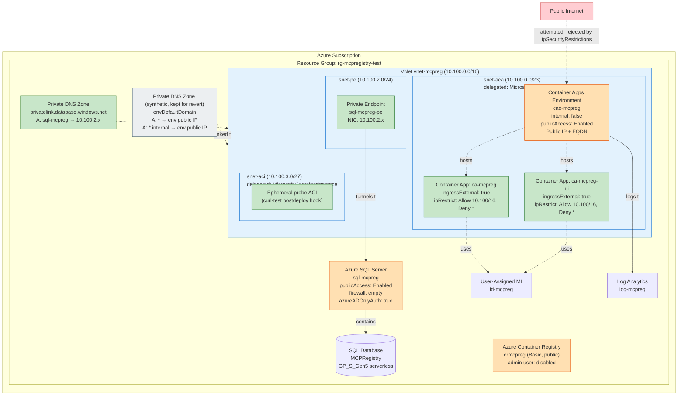
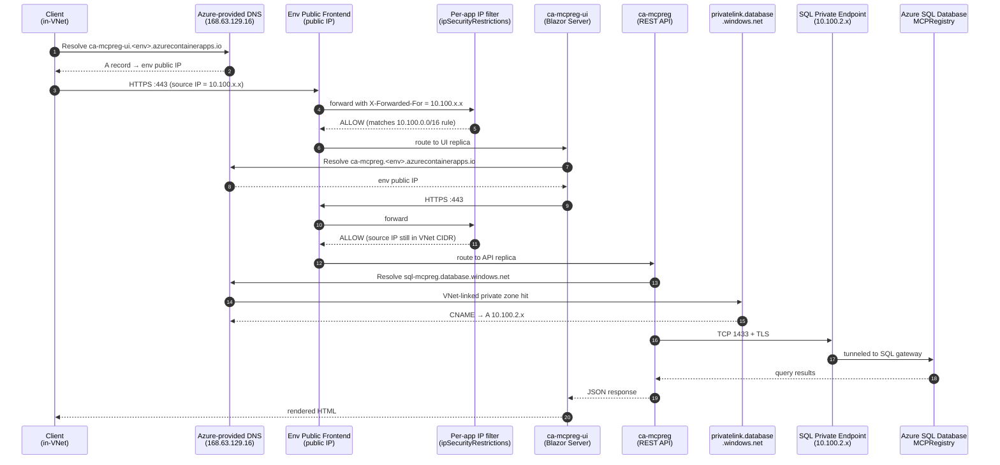
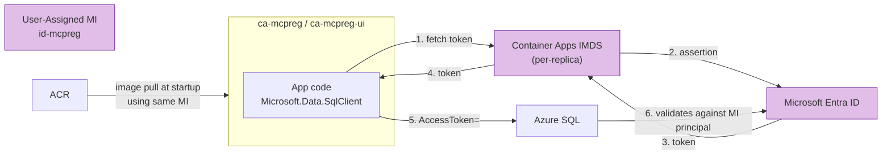
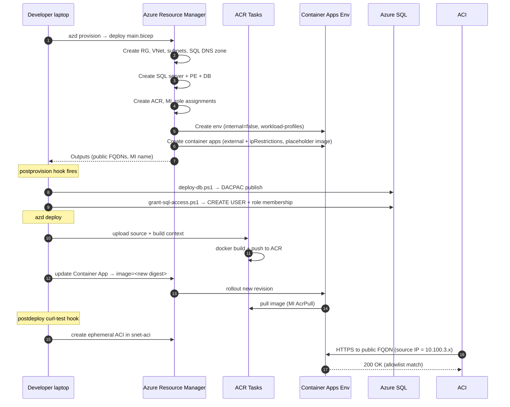
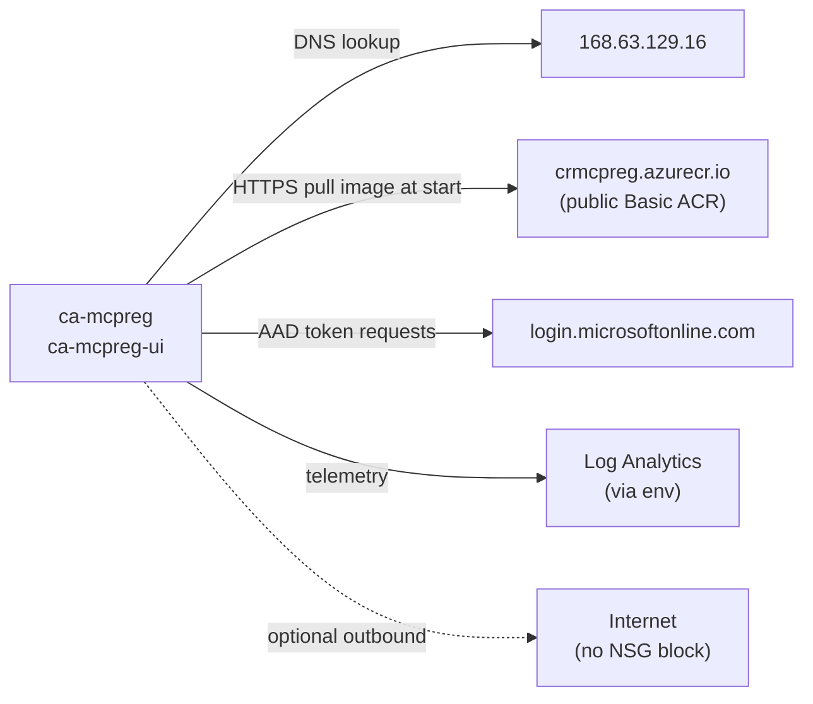
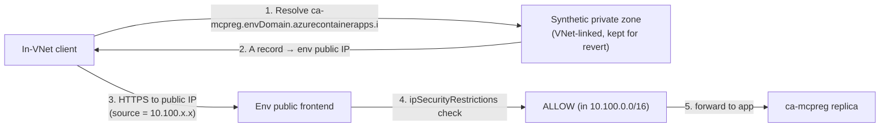

# MCP Registry — Architecture (Option B: External env + IP Allowlist)

> **Why this exists.** Our original lockdown used `internal: true` on the Container Apps environment. That path is blocked by an open Microsoft platform bug ([microsoft/azure-container-apps#1714](https://github.com/microsoft/azure-container-apps/issues/1714)) where the internal load balancer returns `404 Container App is stopped or does not exist` for healthy replicas, even with Microsoft's own hello-world sample. Option B is the **minimal-change workaround**: keep the env external (which works), but restrict every app's ingress to the VNet CIDR via `ipSecurityRestrictions`. The public FQDN exists and resolves on the internet, but only requests sourced from inside our VNet (or peered VNets) get past the L7.

---

## Design goals

- **Get unblocked fast.** This is the lowest-risk, lowest-cost change to escape the platform bug.
- **No app traffic accepted from the public internet.** Enforced by per-app IP allowlist (default-deny).
- **No public data plane to the database.** Application → SQL still flows over a private endpoint.
- **No SQL passwords anywhere.** Same Entra-only auth as before.
- **Operator-friendly.** Same DACPAC + grant pattern as today.

> **Honest caveat.** This design **does** expose a public DNS name and a public IP for the Container Apps env. We mitigate with default-deny + VNet-CIDR allowlist. That is a *compensating control*, not a true private-only surface. If your security baseline forbids any public listener for the app, pick [Option A](architecture-option-a.md) instead.

---

## Resource inventory & lockdown state

| Resource | Type | Public access | Notes |
|---|---|---|---|
| `vnet-mcpreg-<suffix>` | Virtual Network (10.100.0.0/16) | n/a | Subnets: `snet-aca` (10.100.0.0/23, delegated `Microsoft.App/environments`), `snet-pe` (10.100.2.0/24), `snet-aci` (10.100.3.0/27, delegated `Microsoft.ContainerInstance/containerGroups`) |
| `cae-mcpreg-<suffix>` | Container Apps Environment | **Enabled** | `internal: false`, `publicNetworkAccess: Enabled`, `workloadProfiles: [Consumption]`, `infrastructureSubnetResourceId = snet-aca` |
| `ca-mcpreg-<suffix>` | Container App (API) | **Public FQDN, IP-restricted** | `ingressExternal: true`, `ipSecurityRestrictions: [Allow 10.100.0.0/16, default Deny]` |
| `ca-mcpreg-ui-<suffix>` | Container App (UI) | **Public FQDN, IP-restricted** | Same allowlist |
| `sql-mcpreg-<suffix>` | Azure SQL Server | **Enabled (firewall = empty)** | Private endpoint `sql-mcpreg-<suffix>-pe` in `snet-pe`. Postprovision scripts add a temporary firewall rule from the laptop's egress /24. |
| `MCPRegistry` | SQL Database (Serverless GP_S_Gen5) | n/a | Auto-pause 60 min, 0.5–2 vCore |
| `crmcpreg<suffix>` | Container Registry | **Public (Basic SKU)** | MI AcrPull only, admin user disabled |
| `id-mcpreg-<suffix>` | User-Assigned Managed Identity | n/a | Used by both apps for ACR + SQL |
| `log-mcpreg-<suffix>` | Log Analytics Workspace | n/a | App logs sink |
| `privatelink.database.windows.net` | Private DNS Zone | n/a | Linked to the VNet; A record bound to the SQL PE NIC |
| `<envDefaultDomain>` (synthetic ACA zone) | Private DNS Zone | n/a | Built by [azd/infra/modules/aca-dns.bicep](../azd/infra/modules/aca-dns.bicep). Wildcard A records `*` and `*.internal` → env `staticIp`. In Option B `staticIp` is the env's **public IP**, so these records mirror what Azure's public DNS already returns — **no security benefit in this mode**. Kept for design continuity with the original internal-env layout so the post-bug-fix revert is a one-flag flip. See [DNS approach](#dns-approach). |
| `privatelink.<region>.azurecontainerapps.io` | Private DNS Zone | n/a | **Not created in the base design.** A *different* zone from the synthetic one above — see [Optional hardening](#optional-hardening--add-the-privatelink-zone-if-you-also-add-a-pe). Only relevant if you also add a PE for the env (which converges with [Option A](architecture-option-a.md)). |

> **Difference from internal-only design**: `internal` flips from `true` to `false`; `publicNetworkAccess` flips from `Disabled` to `Enabled`; apps flip `ingressExternal` from `false` to `true` and gain `ipSecurityRestrictions`. The synthetic ACA env private DNS zone is **kept** for design continuity (see [DNS approach](#dns-approach)). SQL design is unchanged.

---

## Network topology



Green = private-only. Orange = public listener (env has one, apps' ingress IS that listener, gated by IP filter). Red = untrusted network. Blue = network containers.

---

## Traffic flow #1 — UI request from inside the VNet

In-VNet callers hit the env's public IP through Azure-internal paths; the per-app IP allowlist permits the connection because the source IP is inside `10.100.0.0/16`.



Key points:
- `ipSecurityRestrictions` evaluates the **caller's source IP** as the env sees it. In-VNet traffic to the env's public IP is routed through Azure's fabric and preserves the private source IP — the rule matches.
- Public-internet callers reach the same FQDN/IP but are rejected at the per-app filter with `HTTP 403`.
- Inter-app calls (UI → API) hit the env's public IP from the UI replica's private IP — still in-CIDR, still allowed.
- SQL data plane is **untouched** by Option B; still PE-only.

---

## Traffic flow #2 — Identity / authentication

Unchanged from the internal-env design. Both apps share a single user-assigned MI.



How auth is wired (unchanged):
- Connection string uses `Authentication=Active Directory Default;User Id=<MI client ID>`.
- MI is added as a SQL principal by [azd/scripts/grant-sql-access.ps1](../azd/scripts/grant-sql-access.ps1) with `db_datareader` + `db_datawriter`.
- Same MI has `AcrPull` on the registry.
- `azureADOnlyAuthentication: true` blocks SQL logins.

---

## Traffic flow #3 — `azd up` provisioning



All operator traffic is to the ARM control plane. The operator's laptop **cannot** reach the deployed apps (its public IP is not in the allowlist) — see "Adding inbound access".

---

## Traffic flow #4 — Postprovision DACPAC and grant scripts

**Unchanged from the internal-env design.** The SQL lockdown is identical; the laptop adds a temporary firewall /24, runs DACPAC + grant, then cleans up.

See the full sequence in [docs/architecture.md](architecture.md#traffic-flow-4--postprovision-dacpac-and-grant-scripts).

---

## Traffic flow #5 — App outbound to internet

Unchanged.



---

## DNS approach

Option B **keeps the synthetic ACA env private DNS zone** built by [azd/infra/modules/aca-dns.bicep](../azd/infra/modules/aca-dns.bicep) — the same module the original internal-env design uses. In Option B's external-env mode the zone provides **no security benefit**; it's retained purely for **design continuity** so reverting to the original internal-env layout after the [platform bug](https://github.com/microsoft/azure-container-apps/issues/1714) is fixed is a one-flag flip.

In Option B, the env is external and `env.staticIp` is a **public IP**. The wildcard A records the synthetic zone publishes (`*` and `*.internal`) therefore point at the **same public IP** that Azure's public DNS already returns. In-VNet callers will resolve to the same answer either way; the security boundary is enforced at L7 by `ipSecurityRestrictions`, not by DNS.



Why we keep the zone in Option B:
- **Revert continuity.** When MS ships a fix, reverting to the original internal-env design is a one-flag flip on the env (`internal: true` + `publicNetworkAccess: 'Disabled'`) plus the inverse flips on each app (`ingressExternal: false`, drop `ipSecurityRestrictions`). The zone's A records automatically start resolving to the **private** internal-LB IP because they read from the `env.staticIp` output, which becomes private when the env flips to internal. No Bicep additions needed for DNS.
- **Peer-VNet links survive.** Any manually-created peer-VNet DNS links (per the [Adding inbound access](#adding-inbound-access-post-deploy) section) stay valid across the Option B period and don't need to be torn down and recreated.
- **Cost is zero.** Private DNS zones are free; the only cost is mild operator confusion, which this section is here to defuse.

What the zone is **not** in Option B:
- **Not a security control.** `ipSecurityRestrictions` is — Container Apps evaluates the caller's source IP, not the DNS name used.
- **Not anchored at any private IP.** The env has no internal LB or PE NIC in this design; the records resolve to the env's public IP.
- **Not the same as `privatelink.<region>.azurecontainerapps.io`.** That's a *different* zone, only meaningful with a Private Endpoint — see [Optional hardening](#optional-hardening--add-the-privatelink-zone-if-you-also-add-a-pe).

### Optional hardening — add the privatelink zone if you also add a PE

If you later decide you want **DNS-level isolation** on top of the IP allowlist (e.g., to ensure no leaked DNS resolution to the public IP, or to defense-in-depth your way to an Option-A-like posture), the change is additive:

1. Add a `privateEndpoints` block to the env (same as [Option A](architecture-option-a.md#what-changes-in-bicep-vs-internal-env-design)) targeting `managedEnvironments` in `snet-pe`.
2. Add the `privatelink.<region>.azurecontainerapps.io` private DNS zone in `network.bicep` and link it to the VNet — the PE's `privateDnsZoneGroup` will auto-create the A record for `<envDomain>`.
3. Leave `publicNetworkAccess: Enabled` (so external callers in your allowlist still work) and **keep** `ipSecurityRestrictions` (so the public IP is still gated).
4. In-VNet callers will now resolve via the private zone to the PE NIC; external allowlisted callers continue to resolve via public DNS to the env's public IP.

At that point you're paying ~$7/mo for the PE in exchange for stronger DNS isolation. If you go one step further and flip `publicNetworkAccess: Disabled` + drop `ipSecurityRestrictions`, you have Option A.

---

## Reachability matrix

| Source | API ingress | UI ingress | SQL data plane | ACR | Azure ARM (mgmt) |
|---|---|---|---|---|---|
| Public internet | ❌ blocked (ipSecurityRestrictions default-deny) | ❌ same | ❌ rejected (firewall = empty) | ✅ public | ✅ public, AAD-auth |
| Inside `vnet-mcpreg` (in-env replicas, ACI, etc.) | ✅ via env public IP (allowlist hit) | ✅ same | ✅ via SQL PE | ✅ public + MI auth | n/a |
| Peered VNet (when configured) | ✅ if peer CIDR is added to allowlist | ✅ same | ✅ via SQL PE | ✅ public | ✅ |
| Operator laptop | ❌ unless their /24 is temporarily added to allowlist | ❌ same | ✅ during postprovision (temp /24 firewall rule) | ✅ public via az push | ✅ |

---

## What changes in Bicep (vs. internal-env design)

[azd/infra/modules/resources.bicep](../azd/infra/modules/resources.bicep):

```diff
 module containerAppsEnv 'br/public:avm/res/app/managed-environment:0.13.1' = {
   params: {
-    internal: true
+    internal: false
     infrastructureSubnetResourceId: acaSubnetId
-    publicNetworkAccess: 'Disabled'
+    publicNetworkAccess: 'Enabled'
     workloadProfiles: [
       { name: 'Consumption', workloadProfileType: 'Consumption' }
     ]
   }
 }

 module containerApp 'br/public:avm/res/app/container-app:0.22.0' = {
   params: {
-    ingressExternal: false
+    ingressExternal: true
     ingressTargetPort: 8080
+    ipSecurityRestrictions: [
+      {
+        name: 'allow-vnet'
+        action: 'Allow'
+        ipAddressRange: '10.100.0.0/16'
+        description: 'Allow only callers from inside vnet-mcpreg'
+      }
+    ]
   }
 }
```

Same change on `containerAppUi`. The synthetic `aca-dns.bicep` module is **left in place** — see [DNS approach](#dns-approach) for why. In Option B the zone's records resolve to the env's public IP (no isolation benefit), but keeping the module wired makes the eventual revert to the original internal-env design a one-flag flip.

No changes to [azd/infra/modules/network.bicep](../azd/infra/modules/network.bicep) beyond the snet-aci subnet already added (for the curl-test ACI). No new private DNS zones for ACA — the synthetic one carries over from the original design unchanged.

The VNet CIDR `10.100.0.0/16` is parameterized in `main.bicep` already; we pass it into `resources.bicep` so the allowlist is auto-generated and stays in sync if the CIDR ever changes.

---

## Adding inbound access (post-deploy)

Two patterns, both simple:

1. **Add a peer VNet to the allowlist:**
   ```bicep
   ipSecurityRestrictions: [
     { name: 'allow-vnet',  action: 'Allow', ipAddressRange: '10.100.0.0/16' }
     { name: 'allow-peer',  action: 'Allow', ipAddressRange: '10.200.0.0/16' }
   ]
   ```
   No DNS work required — public DNS already resolves the app FQDNs.

2. **Add an operator's egress IP temporarily** (the same trick we use for SQL):
   ```powershell
   $myIp = (Invoke-RestMethod https://api.ipify.org)
   az containerapp ingress access-restriction set -g rg-mcpregistry-test -n ca-mcpreg `
     --rule-name my-laptop --ip-address "$myIp/32" --action Allow
   # ... do work ...
   az containerapp ingress access-restriction remove -g rg-mcpregistry-test -n ca-mcpreg `
     --rule-name my-laptop
   ```

---

## Trade-offs vs. Option A (PE-only)

| Dimension | Option A (PE-only) | Option B (this doc) |
|---|---|---|
| Public reachability | None (PE-only) | Public FQDN exists; IP-restricted |
| Inbound DDoS surface | Effectively none | Public IP exposed; relies on IP filter |
| Cost | +PE (~$7/mo) + privatelink zone (free) | $0 extra |
| Setup complexity | Higher (env PE, DNS group) | Lower (just `ipSecurityRestrictions`) |
| In-VNet latency | One extra PE hop | Goes out to public LB and back |
| Failure mode if rule misconfigured | Hard-fail (no path) | Soft-fail (could over-allow) — review rules in PRs |
| Audit posture | Cleanest — env is genuinely unreachable from public internet | Compensating control on a public surface |

Option B is the **minimum-cost, minimum-change** workaround. Pick it when "good enough" beats "perfectly private" and you want the simplest possible Bicep diff.

---

## Known gaps and possible future hardening

- **`ipSecurityRestrictions` is the only thing standing between the internet and the apps.** Any drift (someone widens the rule, or a 0.0.0.0/0 Allow sneaks in) breaks the security model. Mitigations: review rules in PRs; add an Azure Policy denying any Allow with CIDR `>/16`; alert on rule changes via Activity Log.
- **No WAF / DDoS Std.** Public exposure means basic Azure DDoS Basic only. Add Front Door Premium + WAF if the public IP needs L7 protections, even with the allowlist.
- **ACR is public.** Same as Option A.
- **SQL public listener stays on** for operator convenience. Same as Option A.
- **Microsoft platform bug context.** This design exists because [microsoft/azure-container-apps#1714](https://github.com/microsoft/azure-container-apps/issues/1714) makes `internal: true` envs unusable. When MS ships a fix, the revert path is intentionally minimal: flip `internal: true` + `publicNetworkAccess: 'Disabled'` on the env, flip `ingressExternal: false` and remove `ipSecurityRestrictions` on both apps. The synthetic ACA env DNS zone is already wired (see [DNS approach](#dns-approach)) and its A records become correct automatically once `env.staticIp` becomes the internal LB IP — no DNS work needed at revert time.
