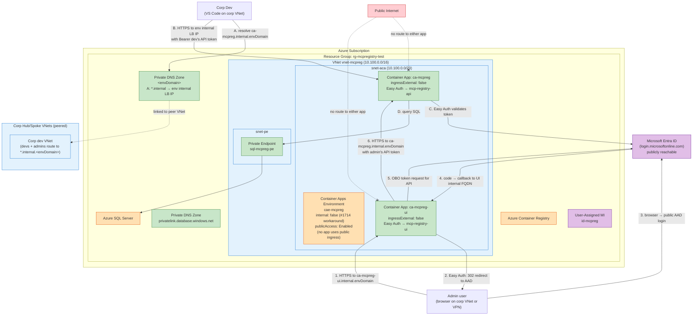
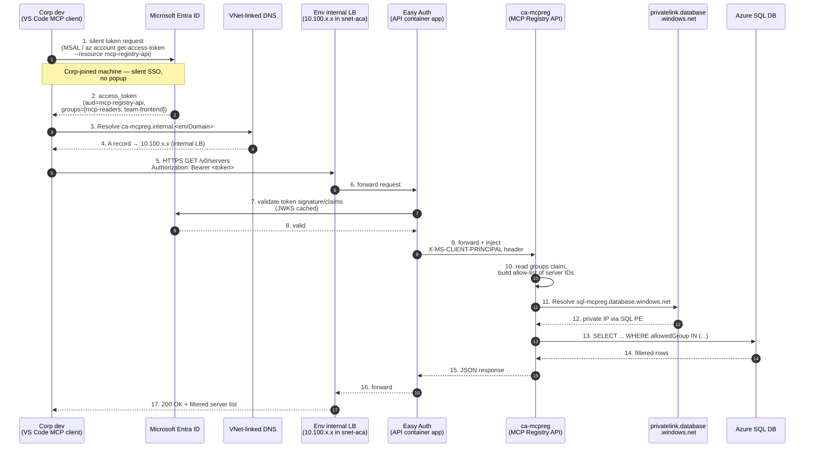
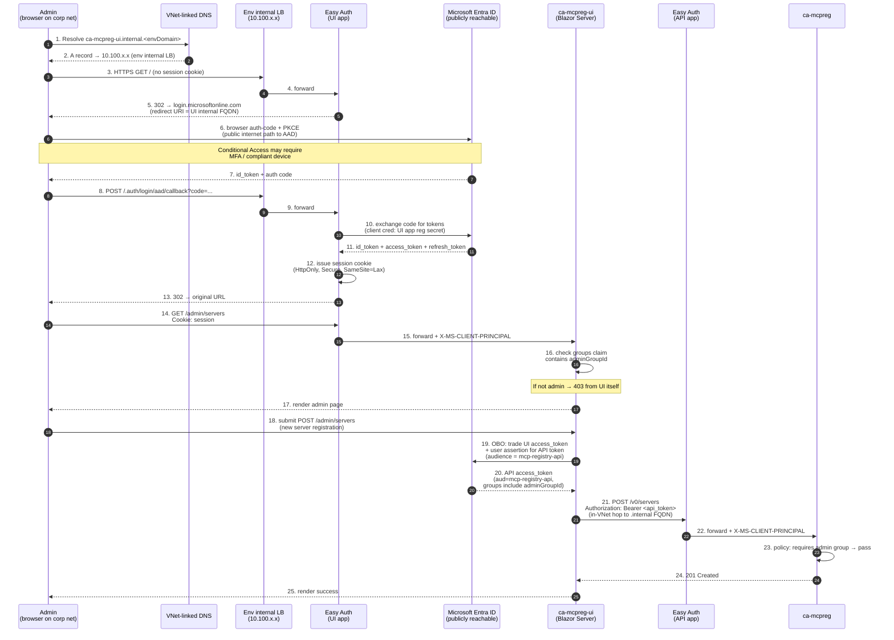
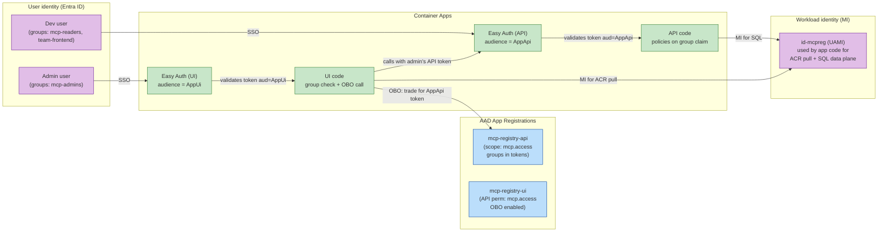
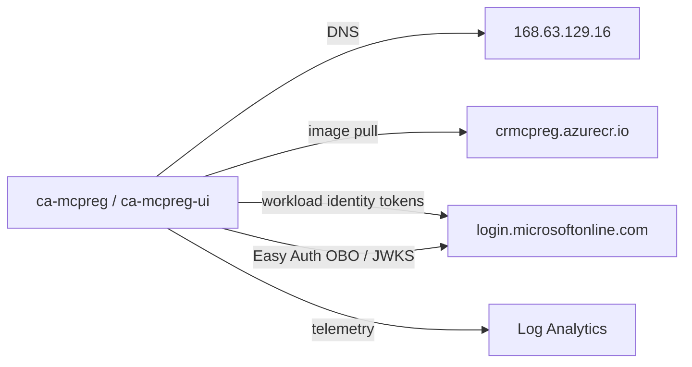

# MCP Registry — Architecture (Option C: Both apps internal + Entra Easy Auth)

> **Why this exists.** [Option B](architecture-option-b.md) tried to use `ipSecurityRestrictions` as a client-IP allowlist on a public Container App. We verified by exhaustive binary-search bisection (2026-05-18) that **Container Apps external ingress is fronted by a regional Microsoft Anycast NAT** — in `centralus`, envoy sees the source in `20.97.0.0/17` (`AzureCloud.southcentralus`), **not the real client IP**. The `ipSecurityRestrictions` mechanism therefore cannot filter by real client public IP on external apps; the previously-designed `extraAllowedSourceCidrs` allowlist is architecturally unable to do what it was supposed to do. Option C replaces network-IP filtering with **Microsoft Entra ID authentication and group-based authorization** at the application boundary. **Both the UI and the API are internal-only**: every caller (devs *and* admins) is expected to be on the corp network or VPN'd in, and identity/authorization is layered on top via Entra Easy Auth. See discovery details below.

---

## Design goals

- **All callers reach the apps over corp network only.** Both the API and the UI have `ingressExternal: false` — no public FQDN, no public IP path. Reachability is gated by VNet peering and the synthetic ACA private DNS zone link.
- **Devs on the corp VNet pull the MCP server list from the API**, optionally filtered by the dev's Entra group membership (per-team filtering is a follow-up — see [Known gaps](#known-gaps-and-possible-future-hardening)).
- **Admins manage the catalog through the UI**, restricted to an admin Entra group.
- **Write endpoints (POST/DELETE) on the API are gated by the admin group claim** — not by "the UI is the only caller" (which is not a security control). A dev with a valid token but no admin claim gets `403` from any client.
- **No client-IP filtering**. Network plane (VNet peering + DNS link for both apps) defines the *reachability surface*; Entra group claims define *who is allowed* inside it.
- **The UI client secret stays out of source.** Generated by the preprovision hook, stored in azd env as a secret, flowed to a Container App secret via Bicep `@secure()` param, referenced by Easy Auth via `clientSecretSettingName`.
- **Workload identity remains a user-assigned MI** (no SQL passwords, no DB connection string secrets). User identity is layered separately via Entra Easy Auth.
- **Operator-friendly.** DACPAC + grant scripts unchanged from Option B; new preprovision hook is idempotent (create-or-reuse AAD app registrations).

---

## Resource inventory & lockdown state

| Resource | Type | Public access | Notes |
|---|---|---|---|
| `vnet-mcpreg-<suffix>` | Virtual Network (10.100.0.0/16) | n/a | Subnets unchanged: `snet-aca` (10.100.0.0/23), `snet-pe` (10.100.2.0/24), `snet-aci` (10.100.3.0/27) |
| `cae-mcpreg-<suffix>` | Container Apps Environment | **Enabled** at the env level (workaround for [#1714](https://github.com/microsoft/azure-container-apps/issues/1714)), but **no app uses the public ingress**. `internal: false`, `publicNetworkAccess: Enabled`, workload-profiles env. |
| `ca-mcpreg-<suffix>` (API) | Container App | **Internal-only** | `ingressExternal: false`. Reachable only from inside the env's VNet (and any peered VNet whose CIDR can route to the env's internal LB IP and that has a DNS link to the env's synthetic private zone). Easy Auth bound to `mcp-registry-api` app registration. |
| `ca-mcpreg-ui-<suffix>` (UI) | Container App | **Internal-only** | `ingressExternal: false`. Reachable only from inside the env's VNet (and any peered VNet whose admin user can resolve `ca-mcpreg-ui.internal.<envDomain>`). Easy Auth bound to `mcp-registry-ui` app registration; unauthenticated requests redirect to AAD login (which is publicly reachable from the admin's browser even when the UI itself is not). |
| `ca-mcpreg-<suffix>/authConfigs/current` | Container App auth config | n/a | Per-app Easy Auth resource. `globalValidation.unauthenticatedClientAction: Return401`. |
| `ca-mcpreg-ui-<suffix>/authConfigs/current` | Container App auth config | n/a | Same shape; `unauthenticatedClientAction: RedirectToLoginPage`; references a client secret stored in the UI container app's secrets. |
| `mcp-registry-api` | Entra ID app registration | n/a | Exposes a scope (e.g., `mcp.access`). Group claims included in tokens. Used by Easy Auth on the API container app and as the audience for tokens minted by the UI's OBO flow and by dev CLI clients. |
| `mcp-registry-ui` | Entra ID app registration | n/a | Used by Easy Auth on the UI container app. Configured for browser sign-in (auth-code + PKCE). Has API permission for `mcp-registry-api/mcp.access` with admin consent granted. |
| `mcp-readers` | Entra ID security group | n/a | All corp devs allowed to query the registry. Membership can be team-scoped (multiple narrower groups), see [Authorization model](#authorization-model). |
| `mcp-admins` | Entra ID security group | n/a | Users authorized for writes (POST/DELETE) and for UI access. Conditional Access may add MFA / compliant device requirements. |
| `sql-mcpreg-<suffix>` | Azure SQL Server | **Enabled (firewall = empty)** | PE-only data plane, unchanged from Option B. |
| `MCPRegistry` | SQL Database (Serverless GP_S_Gen5) | n/a | Unchanged. |
| `crmcpreg<suffix>` | Container Registry | **Public (Basic SKU)** | Unchanged. MI AcrPull. |
| `id-mcpreg-<suffix>` | User-Assigned Managed Identity | n/a | Workload identity for ACR + SQL. **Not** the user identity — separate from Easy Auth. |
| `log-mcpreg-<suffix>` | Log Analytics Workspace | n/a | Unchanged. |
| `privatelink.database.windows.net` | Private DNS Zone | n/a | Unchanged (SQL PE). |
| `<envDefaultDomain>` (synthetic ACA zone) | Private DNS Zone | n/a | Built by [azd/infra/modules/aca-dns.bicep](../azd/infra/modules/aca-dns.bicep). In Option C the API uses `.internal.<envDomain>` which resolves to the env's **internal LB IP** (a private IP inside the VNet), so this zone is doing real work for the API path. UI continues to resolve via public DNS. |

> **Difference from Option B**: API drops `ipSecurityRestrictions` and gains an `authConfigs` child resource bound to a new AAD app registration. UI flips `ingressExternal` from `true` to `false`, drops `ipSecurityRestrictions`, and gains its own `authConfigs` child resource bound to a separate AAD app registration. Two AAD groups and two app registrations are new. SQL design is unchanged. The `extraAllowedSourceCidrsCsv` parameter is removed entirely (had no working purpose).

---

## Network topology



Green = private-only (apps + DNS + SQL data plane). Orange = the env itself is technically external (#1714 workaround), but no app sits on its public ingress. Purple = identity (publicly reachable AAD). Red = untrusted network.

---

## Traffic flow #1 — Dev pulls MCP server list (VS Code → API)

The API is internal-only. Devs reach it because their corp VNet is peered into our VNet (`hubVnetResourceId`) and the synthetic ACA private DNS zone is linked into a VNet they can resolve against (`dnsZoneLinkVnetResourceIdsCsv`). Easy Auth then validates the bearer token and the application filters the result set by group claim.



Key points:
- The API has **no public FQDN**. A determined attacker on the public internet has no DNS name and no IP to target — the env's public IP rejects routes to internal-only apps at the L7 (returns 404 for unknown hostnames; only the UI's hostname is registered).
- The dev's token is acquired silently from the corp AAD tenant. On a corp-joined machine, no browser popup occurs.
- `X-MS-CLIENT-PRINCIPAL` is a base64-JSON header injected by Easy Auth containing the user's identity and claims. The API never validates JWTs itself.
- Result-set filtering by group is **application logic** (an EF Core / SQL filter on each query), not a platform feature. The server-list-to-group mapping lives in the database.

---

## Traffic flow #2 — Admin manages catalog (browser → UI → API)

The UI is internal-only. The admin's browser must be on the corp network or VPN'd in to reach the UI's `.internal.<envDomain>` FQDN. Easy Auth on the UI redirects unauthenticated traffic to AAD (which is publicly reachable from the browser even when the UI itself is not). The admin signs in, the UI checks they are a member of `mcp-admins`, and uses on-behalf-of (OBO) to mint an API token bearing the admin's identity for write calls.



Key points:
- AAD's login pages are public; the *UI* is not. The auth code that AAD POSTs back to the UI's `/.auth/login/aad/callback` is delivered by the admin's browser (which is on the corp network), not by AAD's servers directly. AAD never reaches the UI directly — it just hands the code to the admin's browser to POST.
- The UI's redirect URI on the AAD app registration is set to `https://ca-mcpreg-ui.<envDefaultDomain>/.auth/login/aad/callback` after provisioning (the env's default domain is only known after the env exists). This is wired by a postprovision script.
- The UI never calls the API as itself — every request uses the admin's identity via OBO, so the API sees the actual user (with their groups) and enforces authorization on its own terms.
- UI→API traffic stays in-VNet: it resolves `ca-mcpreg.internal.<envDomain>` via the synthetic private zone (zone is linked to the env's own VNet by default), hits the env's internal LB IP, never leaves the VNet.
- A dev who tries to call `POST /v0/servers` directly bypasses the UI entirely: their token lacks the admin group, the API policy returns `403`. The UI is not the security boundary; the admin group claim is.

---

## Traffic flow #3 — Identity & authorization model

Two layers of identity, kept distinct:



**Workload identity (MI)** is unchanged from Options A/B — used by app code to authenticate to SQL and pull from ACR. The MI is *not* the user; it represents the app's right to use Azure resources.

**User identity (Entra)** is new in Option C — represents the human/CLI making the request. Flows through Easy Auth into the app via `X-MS-CLIENT-PRINCIPAL`.

### Authorization model

| Endpoint | Group required | Behavior |
|---|---|---|
| `GET /v0/servers` | `mcp-readers` (or any of the team sub-groups) | Returns server records whose `allowedGroups` column intersects the caller's groups claim |
| `GET /v0/servers/{id}` | `mcp-readers` | 200 if caller's groups overlap the row's `allowedGroups`; 404 otherwise (do not leak existence) |
| `POST /v0/servers` | `mcp-admins` | Creates a new server record; rejected with 403 for non-admins |
| `DELETE /v0/servers/{id}` | `mcp-admins` | Soft-delete (MCP spec) |
| UI routes under `/admin/*` | `mcp-admins` | UI redirects non-admins to a "no access" page or 403 |
| UI routes under `/` (read-only browse) | any authenticated | Optional: lets devs browse the catalog from a browser too |

`allowedGroups` on each server row is a list of group object IDs; an empty list could mean "all readers" (decide convention before launch). Group-claim filtering happens in `IServerRepository` so both read endpoints share one code path.

### Token sources (corp dev side)

| Caller | How to get the token |
|---|---|
| VS Code MCP extension on corp-joined machine | MSAL silent SSO using machine's broker (WAM) — no popup |
| VS Code MCP extension on personal machine joined to corp tenant | MSAL with broker; first run prompts for login |
| `curl` / scripts | `az account get-access-token --resource <mcp-registry-api-client-id>` (works in Azure CLI sessions) |
| `azd` extensions | `azd auth token --output json --tenant-id <corp>` |

---

## Traffic flow #4 — Provisioning (`azd up`)

Largely unchanged from Option B; the new pieces are the two AAD app registrations and the two `authConfigs` child resources.

```mermaid
sequenceDiagram
    autonumber
    participant Dev as Operator laptop
    participant ARM as Azure Resource Manager
    participant GraphAPI as Microsoft Graph
    participant ACRTasks as ACR Tasks
    participant CAE as Container Apps Env

    Dev->>GraphAPI: 1. preprovision hook: create<br/>mcp-registry-api app reg + scope<br/>mcp-registry-ui app reg + redirect URI<br/>(idempotent; reuse if exists)
    GraphAPI-->>Dev: 2. App IDs + client IDs
    Dev->>Dev: 3. store IDs in azd env vars<br/>(AZURE_API_APP_CLIENT_ID,<br/>AZURE_UI_APP_CLIENT_ID)

    Dev->>ARM: 4. azd provision → main.bicep
    ARM->>ARM: 5. RG, VNet, subnets, DNS zones (unchanged)
    ARM->>ARM: 6. SQL + PE + DB (unchanged)
    ARM->>ARM: 7. ACR + MI + role assignments (unchanged)
    ARM->>CAE: 8. Create env (internal=false, workload-profiles)
    ARM->>CAE: 9. Create API container app<br/>(ingressExternal=false, no ipRestrictions)
    ARM->>CAE: 10. Create authConfigs child on API<br/>(audience = AZURE_API_APP_CLIENT_ID)
    ARM->>CAE: 11. Create UI container app<br/>(ingressExternal=true, no ipRestrictions)
    ARM->>CAE: 12. Create authConfigs child on UI<br/>(audience = AZURE_UI_APP_CLIENT_ID)

    Note over Dev: postprovision hook (unchanged from Option B)
    Dev->>ARM: 13. DACPAC deploy + grant scripts

    Note over Dev: azd deploy
    Dev->>ACRTasks: 14. build + push images
    Dev->>ARM: 15. roll new revisions
```

The preprovision hook to manage AAD app registrations is the meaningful new piece. Options for implementing it:
1. **PowerShell + `Microsoft.Graph` module** — most portable, runs from any machine with `Connect-MgGraph`.
2. **`az ad app` CLI** — simplest in bash/pwsh; requires the operator to have `Application Developer` role or the per-app create-app permission.
3. **Bicep with the [Microsoft.Graph extension](https://learn.microsoft.com/graph/templates/quickstart-create-app-registrations)** — declarative; experimental but officially supported in azd templates. Requires the operator (or a deploy SPN) to have Graph `Application.ReadWrite.All` or `Application.ReadWrite.OwnedBy`.

Recommendation: start with PowerShell preprovision hook (lowest dependency cost), migrate to Bicep extension once it stabilises.

---

## Traffic flow #5 — App outbound

Unchanged from Option B except that Easy Auth adds traffic to `login.microsoftonline.com` and `graph.microsoft.com` (for OBO and JWKS rotation):



No NSG egress restriction added. If a future hardening requires it, allow `AzureCloud` (or specifically `MicrosoftContainerRegistry`, `AzureActiveDirectory`, `Sql`, `Storage`, `AzureMonitor`) and deny the rest.

---

## DNS approach

Two paths, one each per app:

**API path (in-VNet only):**
1. Caller resolves `ca-mcpreg.internal.<envDomain>` against the VNet-linked synthetic ACA private DNS zone.
2. Zone returns the env's **internal LB IP** (a 10.100.x.x address in `snet-aca`).
3. Connection stays inside the VNet (or peer VNet via VNet peering + DNS link).
4. Easy Auth on the API validates the bearer token before any app code runs.

**UI path (public, auth-gated):**
1. Caller resolves `ca-mcpreg-ui.<envDomain>` against public Azure DNS.
2. Public DNS returns the env's **public IP**.
3. TCP/TLS terminates at the env's public ingress; Easy Auth on the UI sees the request.
4. Unauthenticated → 302 to AAD login. Authenticated → forwarded to UI replica.

The synthetic ACA private DNS zone (built by [azd/infra/modules/aca-dns.bicep](../azd/infra/modules/aca-dns.bicep)) is **load-bearing for the API path** in Option C — without it, peer-VNet clients cannot resolve `ca-mcpreg.internal.<envDomain>` to the env's internal LB IP. Make sure `dnsZoneLinkVnetResourceIdsCsv` includes any VNet (typically the hub VNet hosting a DNS Private Resolver) that needs to resolve the API.

---

## Reachability matrix

| Source | API ingress | UI ingress | SQL data plane | ACR |
|---|---|---|---|---|
| Public internet (any user) | ❌ no DNS + no route (internal-only) | ❌ no DNS + no route (internal-only) | ❌ firewall empty | ✅ public, MI-auth |
| Corp-VNet user, unauthenticated | ✅ reachable, but Easy Auth → 401 | ✅ reachable, but Easy Auth → 302 to AAD login | ❌ | ✅ |
| Corp-VNet user, authenticated (any) | ✅ reads allowed; writes → 403 | ❌ UI returns 403 (only admin group allowed in UI) | n/a | ✅ |
| Corp-VNet user in admin group | ✅ reads + writes allowed | ✅ admin UI | n/a | ✅ |
| Operator laptop during postprovision | ❌ (laptop not on peer VNet) | ❌ same | ✅ temp /24 firewall rule (existing pattern) | ✅ |

Two independent layers: **network** restricts *who can reach* the apps (corp VNet only) and **identity** restricts *who can use* them (any authenticated user can read the catalog; only the admin group can write or use the UI).

---

## What changes in Bicep (vs. Option B)

[azd/infra/main.parameters.json](../azd/infra/main.parameters.json) and [azd/infra/main.bicep](../azd/infra/main.bicep):

```diff
- "extraAllowedSourceCidrsCsv": { "value": "${AZURE_EXTRA_ALLOWED_SOURCE_CIDRS=}" }
+ "apiAppClientId":             { "value": "${AZURE_API_APP_CLIENT_ID}" }
+ "uiAppClientId":              { "value": "${AZURE_UI_APP_CLIENT_ID}" }
+ "uiAppClientSecret":          { "value": "${AZURE_UI_APP_CLIENT_SECRET}" }   // @secure() in main.bicep
+ "tenantId":                   { "value": "${AZURE_TENANT_ID}" }
+ "adminGroupId":               { "value": "${AZURE_ADMIN_GROUP_ID}" }
```

`AZURE_TENANT_ID` is set automatically by `azd auth login`. The two app client IDs and the UI client secret are written by the preprovision hook. `AZURE_ADMIN_GROUP_ID` is set manually with `azd env set AZURE_ADMIN_GROUP_ID <object-id>` once after creating the admin group.

[azd/infra/modules/resources.bicep](../azd/infra/modules/resources.bicep):

```diff
 module containerApp 'br/public:avm/res/app/container-app:0.22.0' = {
   params: {
     ingressExternal: false       // unchanged from current state
-    ipSecurityRestrictions: [for ... in allowedSourceCidrs ...]
   }
 }

 module containerAppUi 'br/public:avm/res/app/container-app:0.22.0' = {
   params: {
-    ingressExternal: true
+    ingressExternal: false       // both apps internal-only
-    ipSecurityRestrictions: [for ... in allowedSourceCidrs ...]
+    secrets: { secureList: [ { name: 'aad-client-secret', value: uiAppClientSecret } ] }
   }
 }

+ // Easy Auth — API. Returns 401 for unauthenticated; tokens validated against
+ // the mcp-registry-api app registration. Group claims flow through to the
+ // app via X-MS-CLIENT-PRINCIPAL for the API's group-based authz policies.
+ resource apiAuthConfig 'Microsoft.App/containerApps/authConfigs@2024-03-01' = {
+   parent: <api app symbol>
+   name: 'current'
+   properties: {
+     platform: { enabled: true }
+     globalValidation: {
+       unauthenticatedClientAction: 'Return401'
+       redirectToProvider: 'azureactivedirectory'
+     }
+     identityProviders: {
+       azureActiveDirectory: {
+         enabled: true
+         registration: {
+           openIdIssuer: 'https://login.microsoftonline.com/${tenantId}/v2.0'
+           clientId: apiAppClientId
+         }
+         validation: {
+           allowedAudiences: ['api://${apiAppClientId}']
+         }
+       }
+     }
+   }
+ }
+
+ // Easy Auth — UI. Redirects unauthenticated to AAD login.
+ resource uiAuthConfig 'Microsoft.App/containerApps/authConfigs@2024-03-01' = {
+   parent: <ui app symbol>
+   name: 'current'
+   properties: {
+     platform: { enabled: true }
+     globalValidation: {
+       unauthenticatedClientAction: 'RedirectToLoginPage'
+       redirectToProvider: 'azureactivedirectory'
+     }
+     identityProviders: {
+       azureActiveDirectory: {
+         enabled: true
+         registration: {
+           openIdIssuer: 'https://login.microsoftonline.com/${tenantId}/v2.0'
+           clientId: uiAppClientId
+           // clientSecretSettingName: 'AAD_CLIENT_SECRET'  // see secret note below
+         }
+         validation: {
+           allowedAudiences: ['api://${uiAppClientId}']
+         }
+       }
+     }
+   }
+ }
```

Note: the AVM `app/container-app` module wraps the underlying `Microsoft.App/containerApps` resource but does not expose `authConfigs` as a sub-parameter at the time of writing. Two options:
1. Use the AVM module for the container app and declare `Microsoft.App/containerApps/authConfigs` as a separate raw resource keyed on the app's name.
2. Drop to raw `Microsoft.App/containerApps` for the apps and inline the `authConfigs` sub-resource.

Recommendation: option 1 — keep the AVM module for the apps, add raw `authConfigs` children. Cleanest diff.

The `allowedSourceCidrs` variable, the `extraAllowedSourceCidrs` param, and the entire `ipSecurityRestrictions` block are removed.

### A secret-management note on Easy Auth

The UI's Easy Auth requires a client secret on the AAD app registration to perform the auth-code exchange (step 10 in [Traffic flow #2](#traffic-flow-2--admin-manages-catalog-browser--ui--api)). **Implementation here uses option 1** (Container App secret + `clientSecretSettingName`) for simplicity: the preprovision hook generates a secret, stores it in azd env as `AZURE_UI_APP_CLIENT_SECRET`, Bicep accepts it as a `@secure()` param and writes it into the UI container app's `secrets` array. Rotation is manual: re-run the preprovision script with a `-RotateSecret` switch, then re-provision.

Future options worth migrating to:
2. **Federated credential on the AAD app registration tied to the MI** — no secret stored anywhere. Container Apps Easy Auth support for this is improving but not yet first-class.
3. **Key Vault reference** — `secretref:vaultName/secretName` style. Robust but adds a Key Vault resource.

The API's Easy Auth does not need a client secret (it only validates incoming tokens; it never performs sign-in flows).

---

## Application code changes

### API (`src/MCPRegistry`)

```diff
- // Anonymous endpoints
+ using Microsoft.AspNetCore.Authentication.JwtBearer;
+ using Microsoft.AspNetCore.Authorization;

  var builder = WebApplication.CreateBuilder(args);
+ builder.Services
+   .AddAuthentication(JwtBearerDefaults.AuthenticationScheme)
+   .AddJwtBearer(opt => {
+     // Easy Auth has already validated the token at the platform edge.
+     // We additionally validate locally so the same code runs unchanged
+     // if Easy Auth is bypassed for local dev (e.g. dotnet run).
+     opt.Authority = $"https://login.microsoftonline.com/{builder.Configuration["AzureAd:TenantId"]}/v2.0";
+     opt.Audience = $"api://{builder.Configuration["AzureAd:ApiAppClientId"]}";
+   });
+ builder.Services.AddAuthorization(opt => {
+   opt.AddPolicy("RequireAdmin", p => p.RequireClaim("groups", builder.Configuration["AzureAd:AdminGroupId"]));
+   opt.AddPolicy("RequireReader", p => p.RequireAuthenticatedUser()); // narrow further if needed
+ });

  app.MapControllers();
- // (controllers currently have no auth attributes)
+ // ServersController: add [Authorize(Policy = "RequireReader")] on the class
+ // override with [Authorize(Policy = "RequireAdmin")] on POST and DELETE actions
```

`X-MS-CLIENT-PRINCIPAL` and `JwtBearer` both populate `User.Claims` consistently; the app reads `groups` claim from `ClaimsPrincipal` regardless of which path validated the token.

### UI (`src/MCPRegistry.UI`)

```diff
+ using Microsoft.Identity.Web;
+ using Microsoft.Identity.Web.UI;

  var builder = WebApplication.CreateBuilder(args);
+ builder.Services
+   .AddAuthentication(OpenIdConnectDefaults.AuthenticationScheme)
+   .AddMicrosoftIdentityWebApp(builder.Configuration.GetSection("AzureAd"))
+   .EnableTokenAcquisitionToCallDownstreamApi(new[] { $"api://{apiClientId}/mcp.access" })
+   .AddInMemoryTokenCaches();
+ builder.Services.AddRazorPages().AddMicrosoftIdentityUI();
```

Server-side Blazor uses `ITokenAcquisition` to get the API token for each user (OBO under the hood). The existing `ApiBaseUrl` value (`https://ca-mcpreg.internal.<envDomain>`) keeps working.

For local dev (`dotnet run`), set `AzureAd:Instance` to the standard authority and configure a separate app registration in a dev tenant, or use the `--allow-anonymous` toggle behind a `Development`-only branch — never check that toggle in.

---

## Trade-offs vs. Option B

| Dimension | Option B (IP allowlist) | Option C (this doc) |
|---|---|---|
| Actually filters real client IP | ❌ (verified broken on Container Apps external ingress) | n/a — not used |
| Public exposure | UI + API both public, gated by IP filter | UI public + auth-gated, API internal + auth-gated |
| Filter granularity | Per CIDR | Per user + per group |
| Per-user audit trail | None (envoy sees Microsoft NAT) | Full (`X-MS-CLIENT-PRINCIPAL` carries user OID) |
| Dev experience (CLI) | Connect from corp network → done | Get token (`az account get-access-token`) → `Authorization: Bearer …` → done |
| Operational complexity | Low (Bicep diff only) | Medium (AAD app regs + group mgmt + code changes) |
| Conditional Access compatibility | None | Full (MFA, compliant device, location) — enforced by AAD |
| MFA / device compliance | Cannot enforce | Can enforce via Conditional Access on the app registrations |
| Result-set filtering by team | Cannot do (no user identity) | Native (groups claim → SQL filter) |
| Setup cost | None beyond Bicep change | App registrations (one-time), code changes (~100 lines), group management (ongoing) |

---

## Known gaps and possible future hardening

- **AAD group management is now an operational concern.** A bad addition to `mcp-admins` is the new failure mode. Mitigations: PIM (just-in-time elevation) on `mcp-admins`; Access Reviews quarterly; alerts on group membership changes.
- **OBO + group claims have a 200-group limit per token.** If a user is in > 200 groups, the token contains a `_claim_names` overage marker and the app must call Microsoft Graph to enumerate the rest. The `Microsoft.Identity.Web` package handles this transparently if you call `GetGroupsAsync`; verify before assuming the simple path works in your tenant.
- **Easy Auth caches the JWKS for ~5 minutes.** Token revocation (e.g. on user disable) takes effect after the token's natural expiry (typically 60–90 min for access tokens). For faster invalidation, shorten lifetime via Conditional Access token-lifetime policies, or call `RevokeSignInSessions` on the user.
- **UI client secret (if not using federated credential).** Secret rotation is operator work. Strongly prefer the federated-credential path.
- **Internal API path requires VNet peering + DNS link** for every corp VNet that should reach it. Adding a new peer is a Bicep change (add to `dnsZoneLinkVnetResourceIdsCsv` and create the peering on both sides).
- **No WAF / DDoS Std.** UI is public; consider Azure Front Door + WAF if the UI's login page is a target. Easy Auth at the platform edge mitigates most common abuses (no app code runs for unauthenticated requests).
- **ACR is public.** Same as Options A/B.
- **SQL public listener stays on** for operator convenience. Same as Options A/B.

---

## Why the UI is also internal-only

Originally Option C left the UI public (for admin convenience) and only put the API behind the VNet. After the [`ipSecurityRestrictions` discovery](#discovery-why-ipsecurityrestrictions-was-replaced), keeping the UI public would have meant trusting Easy Auth alone as the front door — fine in principle, but with two downsides:

1. **No network-layer kill switch.** A misconfigured Easy Auth or a future AAD outage would expose the UI directly to the internet.
2. **Inconsistent posture.** API requires you to be on corp net to even attempt a request; UI didn't. Easier to reason about "both internal" than "API internal, UI public."

The trade-off: admins must be on the corp network or VPN'd in to use the UI. For an operations-team-only tool, that's an acceptable constraint and matches how devs already access the API.

---

## Discovery: why `ipSecurityRestrictions` was replaced

For posterity (and to short-circuit anyone trying the same approach again):

**Container Apps external ingress is fronted by an Azure-managed regional Anycast proxy.** The proxy terminates TLS and forwards to your env's Envoy. Envoy sees the **proxy's** source IP, not the real client's. `ipSecurityRestrictions` is enforced by Envoy against the source IP it observes, so the rule matches the proxy's CIDR, not the client's.

**Empirical bisection (2026-05-18)**, single-rule tests on `ca-mcpreg-ui` (`centralus`), client = laptop with real public IP `70.161.37.58`:

| Single Allow rule | Result |
|---|---|
| (no rules) | 200 |
| `0.0.0.0/1` (0–127) | 200 |
| `0.0.0.0/4` (0–15) | 403 |
| `16.0.0.0/5` (16–23) | 200 |
| `20.0.0.0/8` | 200 |
| `20.118.11.26/32` (env's own static IP) | 403 |
| `20.118.0.0/16` | 403 |
| **`20.97.0.0/16`** | **200** |
| `70.161.37.58/32` (real client IP) | 403 |

`20.97.0.0/17` is `AzureCloud.southcentralus` per the Azure service tags list — confirms the proxy lives in a different Azure region's range from the env (`centralus`), reachable via Microsoft's internal Anycast.

**Implications:**
- `ipSecurityRestrictions` on external Container Apps **cannot** filter by client public IP.
- It *can* filter by Microsoft regional proxy ranges (e.g., to restrict to your region's proxy), but those ranges are not part of any SLA — Microsoft can renumber at any time.
- It *does* work as expected on **internal** Container Apps because internal ingress is not fronted by the public Anycast proxy; envoy sees the actual client source IP.
- The fix for client-IP filtering is **Azure Front Door** or **Application Gateway** in front of Container Apps, which preserve `X-Forwarded-For` and source-IP semantics in ways that ipSec can read. Or: skip IP filtering entirely and use Entra auth (Option C).

This finding is recorded in `/memories/aca-ipsec-source-ip.md` (Copilot user-memory) so future sessions don't relitigate it.
