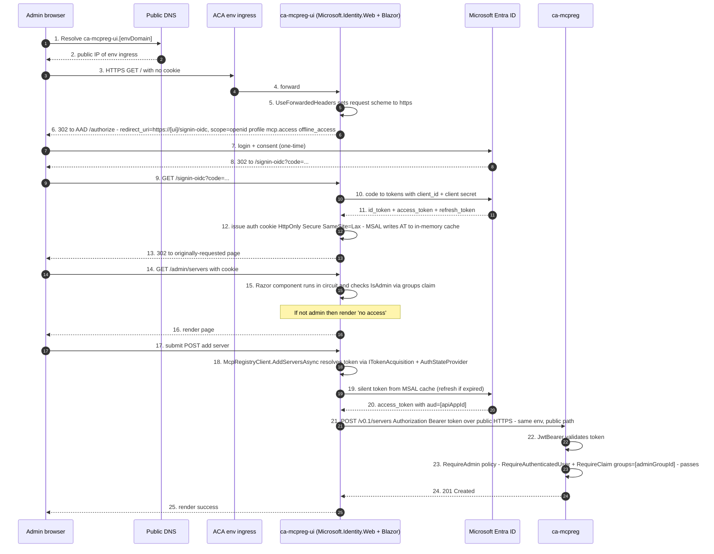

# MCP Registry — Architecture (Option D: Public ACA + in-app Entra auth)

> **Why this exists.** [Option C](architecture-option-c.md) made *both* the UI and the API internal-only and used Container Apps Easy Auth to gate access. Two real-world constraints forced a change:
>
> 1. **VS Code users sit on the public internet, not the corp VNet.** Requiring `dnsZoneLinkVnetResourceIdsCsv` for every dev's machine is not practical. The MCP client UX expects a public HTTPS endpoint reachable from anywhere with a valid token.
> 2. **Easy Auth's `defaultAuthorizationPolicy.allowedApplications` checks the v1 `appid` claim, which is absent from v2 access tokens** (`accessTokenAcceptedVersion = 2` on the API app reg uses `azp` instead). Every UI → API call was rejected at the gateway with HTTP 403 *before* reaching ASP.NET Core. Removing Easy Auth and relying on `Microsoft.Identity.Web` inside the apps fixes the issue and eliminates a redundant auth layer.
>
> Option D therefore: **both apps have public ingress, both validate Entra tokens in-app via Microsoft.Identity.Web** (OIDC for the UI, JwtBearer for the API). The data tier stays fully private behind a private endpoint.

---

## Design goals

- **VS Code MCP clients can reach the API from anywhere on the internet** with a bearer token issued by the corp Entra tenant.
- **Admins reach the UI in a browser from anywhere** (no corp VPN required).
- **Identity is the only access control on the app tier.** Network ACLs were tried in [Option B](architecture-option-b.md) and provably could not see the real client IP behind ACA's regional NAT (`20.97.0.0/17` in `centralus`). They are not used.
- **Auth is enforced in one place, inside the app**, by `Microsoft.Identity.Web`. No Container Apps Easy Auth layer.
- **Write endpoints (POST/DELETE) require the admin group claim.** Read endpoints require any authenticated caller in the tenant.
- **Data tier is fully private.** SQL, the SQL data-protection storage account, and ACR all have `publicNetworkAccess = Disabled` (or `Deny`-by-default with a narrow allowlist) and are reachable from Container Apps only through private endpoints in `snet-pe`.
- **No SQL passwords or connection-string secrets.** Workload identity is a user-assigned MI; user identity is layered separately via the AAD app registrations.
- **Operator-friendly.** Same DACPAC + grant scripts as previous options; AAD app reg setup runs as a preprovision hook (idempotent).

---

## Resource inventory & lockdown state (2026-05-20)

| Resource | Type | Public access | Notes |
|---|---|---|---|
| `vnet-mcpreg-<suffix>` | Virtual Network (10.100.0.0/16) | n/a | See [VNet subnet layout](#vnet-subnet-layout) below. |
| `cae-mcpreg-<suffix>` | Container Apps Environment | **Public ingress (auth-gated)** | Workload-profiles env, VNet-injected on `snet-aca`. `internal: false` so apps get a public FQDN under `<envDefaultDomain>`. **Auth is enforced in-app, not at the network layer.** |
| `ca-mcpreg-<suffix>` (API) | Container App | **Public FQDN** | `ingressExternal: true`. **No `authConfigs` child resource.** Auth via `Microsoft.Identity.Web.AddMicrosoftIdentityWebApi`. |
| `ca-mcpreg-ui-<suffix>` (UI) | Container App | **Public FQDN** | `ingressExternal: true`. **No `authConfigs` child resource.** Auth via `Microsoft.Identity.Web.AddMicrosoftIdentityWebApp` (OIDC sign-in) + `EnableTokenAcquisitionToCallDownstreamApi` (MSAL cache for downstream API). |
| `mcp-registry-api` | Entra ID app registration | n/a | Exposes scope `mcp.access`. `accessTokenAcceptedVersion = 2`. `groupMembershipClaims = SecurityGroup` so `groups` flows into the access token (used by `RequireAdmin`). |
| `mcp-registry-ui` | Entra ID app registration | n/a | Web platform with redirect URIs `https://<ui-fqdn>/signin-oidc` and `https://<ui-fqdn>/signout-callback-oidc`. `requiredResourceAccess` includes `mcp-registry-api/mcp.access` (admin-consented at provision time). |
| `<adminGroupId>` | Entra ID security group | n/a | Membership grants admin (POST/DELETE) on the API. The object ID is wired into the API via the `AzureAd:AdminGroupId` env var. |
| `sql-mcpreg-<suffix>` | Azure SQL Server | **Disabled** | `publicNetworkAccess: Disabled`. `azureADOnlyAuthentication: true`. Reachable only via PE `sql-mcpreg-<suffix>-pe` in `snet-pe`. **Connection policy: `Proxy`** (required — see [SQL connection policy gotcha](#sql-connection-policy-gotcha)). |
| `MCPRegistry` | SQL Database | n/a | Serverless `GP_S_Gen5`, auto-pauses after 60 min. |
| `stdpqjscozaqreylg` | Storage Account (SQL data protection) | **Disabled** | `publicNetworkAccess: Disabled`. Blob PE `stdpqjscozaqreylg-blob-pe` in `snet-pe`. Created by the SQL server for TDE/auditing scratch space. |
| `crmcpreg<suffix>` | Container Registry (Premium) | **Restricted** | `publicNetworkAccess: Enabled` + `networkRuleSet.defaultAction: Deny` + IP allowlist (see [ACR lockdown](#acr-lockdown)). PE `crmcpreg<suffix>-pe` in `snet-pe` for Container Apps pulls. MI has `AcrPull`. |
| `id-mcpreg-<suffix>` | User-Assigned Managed Identity | n/a | Workload identity for ACR + SQL data plane. Not the user identity. |
| `log-mcpreg-<suffix>` | Log Analytics Workspace | n/a | Container App console + system logs. Public (no sensitive data; access gated by Azure RBAC). |
| `privatelink.database.windows.net` | Private DNS Zone | n/a | Linked to `vnet-mcpreg` + `dev-vnet-shared` (via `additionalDnsZoneLinkVnetResourceIds`). |
| `privatelink.blob.core.windows.net` | Private DNS Zone | n/a | Linked to `vnet-mcpreg`. Resolves the storage account blob PE. |
| `privatelink.azurecr.io` | Private DNS Zone | n/a | Linked to `vnet-mcpreg` + `dev-vnet-shared`. Resolves ACR PE for Container Apps. |
| `privatelink.<region>.azurecontainerapps.io` | Private DNS Zone | n/a | Linked to `vnet-mcpreg` + `dev-vnet-shared`. Resolves the env PE — see [env PE](#aca-environment-pe). |

> **Difference vs. Option C**:
> - Both apps flip `ingressExternal` from `false` to `true`.
> - Both `authConfigs/current` resources are **removed**. Auth is in-app only.
> - The UI app registration adds OIDC redirect URIs (`/signin-oidc`, `/signout-callback-oidc`) instead of Easy Auth's `/.auth/login/aad/callback`.
> - The UI does not need a client secret in env vars for app-level OIDC; `AddMicrosoftIdentityWebApp` consumes the secret from configuration once (mounted from a secret env var the same way Option C did, but used inside the app instead of by the platform).
> - SQL connection policy is explicitly set to `Proxy` instead of the default `Redirect`.
> - ACR upgraded to **Premium** to support PE + IP allowlist. Container Apps pull images privately via the PE; laptop pushes go through the public endpoint gated by an IP allowlist (cannot use PE-only because the cross-sub DNS resolver isn't linked to `privatelink.azurecr.io`).
> - A SQL **data-protection storage account** is now locked down with `publicNetworkAccess: Disabled` and a blob PE.
> - The Container Apps env has a **private endpoint** (`groupId: managedEnvironments`) for in-VNet name resolution.
> - **Bastion and dev VM removed** (Entra-protected public ingress eliminates the need for an inside-VNet jump host). See [Bastion + dev VM (removed)](#bastion--dev-vm-removed-but-subnets-reserved).

---

## Network lockdown summary

| Layer | Service | PNA | Default action | Allowlist | Private endpoint |
|---|---|---|---|---|---|
| Identity | Entra ID | n/a | n/a | n/a | n/a |
| Data | SQL Server | **Disabled** | n/a | none | PE in `snet-pe` |
| Data | SQL data-protection Storage | **Disabled** | n/a | none | blob PE in `snet-pe` |
| Artifacts | ACR (Premium) | Enabled | **Deny** | `70.161.37.58/32` (operator), `17.17.0.0/24` (corp egress) | PE in `snet-pe` (Container Apps pulls) |
| Runtime | Container Apps env | Enabled | n/a | n/a | PE in `snet-pe` (in-VNet name resolution) |
| Apps | UI/API container apps | n/a | n/a | n/a (Entra auth is the boundary) | n/a |
| Observability | Log Analytics | Enabled | n/a | n/a | n/a |

> **Why ACR can't be fully PNA=Disabled**: the laptop's DNS resolver (Private DNS Resolver inbound endpoint at `18.0.0.70` in the hub VNet `dev-vnet-shared`) has no `privatelink.azurecr.io` zone link, so it returns the public ACR IP when resolving `crmcpreg<suffix>.azurecr.io`. With PNA=Disabled the public IP is dead and the laptop can't push. The IP allowlist gives equivalent protection: laptop pushes succeed because the egress IP is in the allowlist; everyone else gets HTTP 403.

### ACR lockdown

Driven by the `extraAllowedSourceCidrsCsv` Bicep param ([azd/infra/main.bicep](../azd/infra/main.bicep)), which splits to an array and feeds `networkRuleSetIpRules` on the AVM `container-registry` module. When the CSV is empty the module defaults to `Allow` (open). When non-empty it switches to `Deny` + the IP rules. The current env value is `"17.17.0.0/24,70.161.37.58/32"`.

A postdeploy hook ([azd/scripts/enable-acr-streaming.ps1](../azd/scripts/enable-acr-streaming.ps1)) idempotently enables ACR **artifact streaming** (overlaybd format) on both repos so Container Apps cold-starts pull only the layers they need. Streaming is a cold-start optimization, not correctness.

### ACA environment PE

The Container Apps env has its own private endpoint with `groupId: managedEnvironments`. Per Microsoft's docs, the zone name **must** be `privatelink.<region>.azurecontainerapps.io` (e.g. `privatelink.centralus.azurecontainerapps.io`) for the PE NIC to auto-register an A record. With the wrong zone name (or with the segments swapped) the PE binds fine but no records appear and apps stay unreachable on the private path.

This env PE is not required for Option D end-user flows (UI/API are public + Entra-gated), but it enables in-VNet workloads or peered VPN clients to call apps via FQDN without traversing the public envoy. See [memory: aca-internal-l7-bug](../../memories/aca-internal-l7-bug.md) for context.

### Bastion + dev VM (removed, but subnets reserved)

The original design ([Option C](architecture-option-c.md)) needed a jump VM inside the VNet because both apps were internal-only. Once UI/API became public + Entra-gated, the jump host became redundant. Removed 2026-05-20 to save ~$170/mo (~$140 Bastion Standard + ~$30 D2s_v3 VM with overnight shutdown).

The two empty subnets (`AzureBastionSubnet` 10.100.20.0/26 and `snet-dev` 10.100.4.0/27) are **deliberately left in place** by [network.bicep](../azd/infra/modules/network.bicep): the file's comment is *"Always created (cheap empty subnet) so toggling deployBastion/deployDevVm does not mutate the parent VNet shape."* Re-enabling is a single env-var flip + provision:

```pwsh
azd env set AZURE_DEPLOY_BASTION true
azd env set AZURE_DEPLOY_DEV_VM true
# Set VM admin password as a secret (read from prompt)
$pwd = Read-Host -AsSecureString
azd env set AZURE_DEV_VM_ADMIN_PASSWORD (ConvertFrom-SecureString $pwd -AsPlainText)
azd provision
```

### VNet subnet layout

| Subnet | CIDR | Purpose | Delegated to | Current state |
|---|---|---|---|---|
| `snet-aca` | 10.100.0.0/23 | Container Apps env infrastructure | `Microsoft.App/environments` | In use |
| `snet-pe` | 10.100.2.0/24 | All private endpoints (SQL, Storage, ACR, env) | none | In use (4 PEs) |
| `snet-aci` | 10.100.3.0/27 | Ad-hoc curl-test probes | `Microsoft.ContainerInstance/containerGroups` | In use |
| `snet-dev` | 10.100.4.0/27 | Reserved for opt-in dev VM | none | **Empty (reserved)** |
| `AzureBastionSubnet` | 10.100.20.0/26 | Reserved for opt-in Bastion | none | **Empty (reserved)** |

---

## Network topology

```mermaid
flowchart TB
    Internet["Public Internet"]
    Dev["Corp dev<br/>(VS Code MCP client anywhere)"]
    Admin["Admin user<br/>(browser anywhere)"]
    Operator["Operator laptop<br/>(allowlisted egress IP)"]
    AAD["Microsoft Entra ID<br/>login.microsoftonline.com"]

    subgraph Subscription["Azure Subscription"]
        subgraph RG["Resource Group: rg-mcpregistry-test"]
            subgraph VNET["VNet vnet-mcpreg (10.100.0.0/16)"]
                subgraph SNET_ACA["snet-aca (10.100.0.0/23)"]
                    CAE["Container Apps Environment<br/>cae-mcpreg · internal: false"]
                    APP_API["API: ca-mcpreg<br/>external: true<br/>JwtBearer"]
                    APP_UI["UI: ca-mcpreg-ui<br/>external: true<br/>OIDC + MSAL"]
                end
                subgraph SNET_PE["snet-pe (10.100.2.0/24)"]
                    PE_SQL["PE: sql-mcpreg-pe"]
                    PE_STO["PE: storage-blob-pe"]
                    PE_ACR["PE: crmcpreg-pe"]
                    PE_ENV["PE: cae-mcpreg-pe<br/>(managedEnvironments)"]
                end
                subgraph SNET_RESERVED["snet-dev + AzureBastionSubnet (empty, reserved)"]
                end
            end
            SQL["SQL Server<br/>PNA: Disabled<br/>Proxy mode"]
            STO["Storage (SQL data protection)<br/>PNA: Disabled"]
            ACR["ACR Premium<br/>PNA: Enabled<br/>defaultAction: Deny<br/>+ IP allowlist"]
            MI["User-Assigned MI"]
        end
    end

    Admin -- "1. HTTPS GET / (no cookie)" --> APP_UI
    APP_UI -- "2. 302 → AAD /authorize" --> Admin
    Admin -- "3. browser sign-in" --> AAD
    AAD -- "4. code → /signin-oidc" --> APP_UI
    APP_UI -- "5. code → tokens + MSAL cache" --> AAD
    APP_UI -- "6. Bearer<API access token>" --> APP_API
    APP_API -- "7. JwtBearer validates" --> AAD
    APP_API -- "8. SQL via PE" --> PE_SQL
    PE_SQL --> SQL
    APP_API -. "TDE / audit scratch" .-> PE_STO
    PE_STO --> STO
    CAE -- "image pull via PE" --> PE_ACR
    PE_ACR --> ACR

    Dev -- "A. MSAL → token for mcp.access" --> AAD
    Dev -- "B. Bearer <token> → /v0.1/servers" --> APP_API

    Operator -- "docker push (allowlisted IP)" --> ACR
    Operator -- "azd deploy" --> APP_API

    Internet -. no token .-x APP_API
    Internet -. no login .-x APP_UI
    Internet -. blocked by firewall .-x ACR
    Internet -. PNA disabled .-x SQL
    Internet -. PNA disabled .-x STO

    classDef sub fill:#e3f2fd,stroke:#1976d2
    classDef priv fill:#c8e6c9,stroke:#2e7d32
    classDef pub fill:#ffe0b2,stroke:#e65100
    classDef restricted fill:#fff9c4,stroke:#f57f17
    classDef ext fill:#ffcdd2,stroke:#c62828
    classDef id fill:#e1bee7,stroke:#6a1b9a
    class SNET_ACA,SNET_PE,SNET_RESERVED,VNET sub
    class PE_SQL,PE_STO,PE_ACR,PE_ENV,SQL,STO priv
    class CAE,APP_API,APP_UI pub
    class ACR restricted
    class Internet ext
    class AAD,MI id
```



Green = private-only (data plane via PE). Orange = publicly reachable but Entra-gated (apps). Yellow = restricted (ACR — public endpoint with IP allowlist, plus PE for Container Apps pulls). Purple = identity provider. Red = untrusted source.

---

## Traffic flow #1 — VS Code MCP client pulls server list

The MCP client is a public OAuth caller. It uses MSAL (or any OAuth2 client) to acquire a token for the API app registration's scope, then sends it as `Authorization: Bearer <token>` over the public FQDN.

```mermaid
sequenceDiagram
    autonumber
    participant Dev as VS Code (MCP client)
    participant AAD as Microsoft Entra ID
    participant DNS as Public DNS
    participant ENV as ACA env public ingress (envoy)
    participant API as ca-mcpreg (JwtBearer + controllers)
    participant ZoneSql as privatelink.database.windows.net
    participant SQL as Azure SQL DB

    Dev->>AAD: 1. acquireToken scopes=api://[apiAppId]/mcp.access
    Note over Dev,AAD: Interactive on first run (broker / browser); silent thereafter
    AAD-->>Dev: 2. access_token v2 (aud=apiAppId, scp=mcp.access, groups=...)

    Dev->>DNS: 3. Resolve ca-mcpreg.[envDomain]
    DNS-->>Dev: 4. public IP of env ingress

    Dev->>ENV: 5. TLS handshake (envoy fronts)
    Dev->>ENV: 6. HTTPS GET /v0.1/servers with Authorization Bearer token
    ENV->>API: 7. forward request (X-Forwarded-* set)
    API->>API: 8. UseForwardedHeaders sets scheme=https
    API->>API: 9. JwtBearer fetch JWKS (cached) and validate signature, audience, issuer, expiry
    API->>API: 10. RequireReader policy - RequireAuthenticatedUser passes
    API->>ZoneSql: 11. Resolve sql-mcpreg.database.windows.net
    ZoneSql-->>API: 12. private IP via SQL PE
    API->>SQL: 13. SELECT ... (MI token, Proxy conn)
    SQL-->>API: 14. rows
    API-->>ENV: 15. 200 OK + ServerList
    ENV-->>Dev: 16. response
```

Key points:
- **No corp VNet required for the client.** Anyone with a valid bearer token for the API app registration can reach it.
- **Token validation runs entirely in-app.** `Microsoft.Identity.Web` configures `JwtBearer` with audiences `api://<apiAppId>` and the bare app ID; issuer is `https://login.microsoftonline.com/<tenant>/v2.0`. Anonymous / bad-token → 401 from the JwtBearer middleware.
- **`X-MS-CLIENT-PRINCIPAL` is not used.** That header is an Easy Auth artifact and is absent in Option D. Claims come from the validated JWT.
- **Outbound to SQL stays in the VNet.** The container resolves the SQL PE via the linked private DNS zone, and the connection policy is `Proxy` so all TDS traffic stays on the gateway (port 1433) — the data-node redirect path (ports 11000–11999) is not exposed by the PE.

---

## Traffic flow #2 — Admin manages catalog via UI

The UI is a Blazor Server app reachable on the public internet. `Microsoft.Identity.Web` runs the OIDC sign-in dance and `AddInMemoryTokenCaches` keeps a per-user MSAL cache so downstream API calls reuse the same access token.



Key points:
- **Forwarded headers are mandatory.** ACA's envoy ingress terminates TLS and forwards as `http://` with `X-Forwarded-Proto: https`. Without `UseForwardedHeaders` (with `KnownIPNetworks` + `KnownProxies` cleared), `Microsoft.Identity.Web` emits an `http://` `redirect_uri` and AAD rejects with `AADSTS50011: The reply URL specified in the request does not match`.
- **Token acquisition runs in the Razor circuit scope.** `IHttpClientFactory` constructs `DelegatingHandler` instances in a *different* DI scope from the Razor circuit, so handlers cannot call `AuthenticationStateProvider.GetAuthenticationStateAsync()`. We instead use `AddTypedClient((http, sp) => new McpRegistryClient(http, sp.GetRequiredService<ITokenAcquisition>(), sp.GetRequiredService<AuthenticationStateProvider>(), apiScope))` so the typed client is constructed in the circuit scope and can resolve the auth state correctly.
- **UI → API hop uses the public FQDN.** Same env, same VNet, but the call still goes out to envoy on the public IP. The internal LB IP path (via the synthetic ACA private zone) would work too, but the public path is simpler and the JWT is the security boundary either way.
- **No on-behalf-of (OBO) flow.** The UI uses the same delegated token it acquired on the user's behalf during sign-in — no token exchange against `/oauth2/v2.0/token` for OBO is needed because the API audience is included in the sign-in scopes (`api://<apiAppId>/mcp.access`).

---

## Authorization model

| Endpoint | Policy | Claim required |
|---|---|---|
| `GET /v0.1/servers` (+ variants) | `RequireReader` | `RequireAuthenticatedUser` — any caller with a valid token |
| `GET /v0.1/servers/{name}/versions/...` | `RequireReader` | same |
| `POST /v0.1/servers` | `RequireAdmin` | `RequireAuthenticatedUser` + `RequireClaim("groups", <adminGroupId>)` |
| `DELETE /v0.1/servers/{name}/versions/{version}` | `RequireAdmin` | same |
| UI: `/` and read-only views | `[Authorize]` (default) | any authenticated user |
| UI: admin actions | UI checks `EasyAuthUser.IsAdmin` server-side and hides destructive UI; the API policy is the actual enforcement boundary | groups must contain `<adminGroupId>` |

> **Group overage**: AAD switches from `groups` to `_claim_names` overage when the user is in > 200 groups. Today the API does not call Graph to expand overage — if you expect users in many groups, switch the admin check to a Graph membership query and cache it.

### Token sources (callers)

| Caller | How to get the token |
|---|---|
| VS Code MCP extension | MSAL public client flow (interactive on first run, silent thereafter). Resource = `api://<apiAppId>`, scope = `mcp.access` or `.default`. |
| `curl` / scripts | `az login --scope api://<apiAppId>/.default` once, then `az account get-access-token --resource api://<apiAppId>` |
| Other web apps | Add their app reg to `requiredResourceAccess` of `mcp-registry-api/mcp.access` and admin-consent |
| Workload (no user) | Add app role to `mcp-registry-api`, grant to the workload's MI / SPN, use client credentials flow |

---

## SQL connection policy gotcha

Azure SQL has two connection policies that affect what client traffic looks like:

| Policy | Behaviour |
|---|---|
| `Proxy` | All TDS traffic flows through the gateway on port 1433. |
| `Redirect` | Login goes through the gateway on 1433, then the client is told to reconnect to a data-node IP on ports 11000–11999. |
| `Default` | `Redirect` for clients **inside the same Azure region**, `Proxy` for cross-region. |

The `Default` choice is a performance optimization. **It does not work with private endpoints**: the PE exposes only the gateway IP on port 1433. When the gateway tells the in-region container to switch to a data-node IP on 11xxx, the connection has nowhere to go and the post-login phase times out (~14 s) with:

```
Microsoft.Data.SqlClient.SqlException: Connection Timeout Expired.
The timeout period elapsed during the post-login phase.
[Pre-Login] initialization=...; handshake=...;
[Login] initialization=0; authentication=0;
[Post-Login] complete=14000;
```

Pre-login and login succeeded; post-login hung. Fix:

```bicep
resource sqlConnectionPolicy 'Microsoft.Sql/servers/connectionPolicies@2023-08-01' = {
  parent: sqlServerRef
  name: 'default'
  properties: {
    connectionType: 'Proxy'
  }
}
```

This is wired into [azd/infra/modules/resources.bicep](../azd/infra/modules/resources.bicep) and applies to every server in this environment. See [Microsoft Docs — Connection policy](https://learn.microsoft.com/azure/azure-sql/database/connectivity-architecture#connection-policy).

---

## Forwarded headers gotcha

ACA's envoy ingress terminates TLS and forwards as `http://` with `X-Forwarded-Proto: https`. The .NET pipeline needs to honor that, otherwise:

- The UI emits an `http://` `redirect_uri` → AAD rejects with `AADSTS50011`.
- The API returns `307` for `app.UseHttpsRedirection()` calls.

```csharp
builder.Services.Configure<ForwardedHeadersOptions>(options =>
{
    options.ForwardedHeaders =
        ForwardedHeaders.XForwardedFor |
        ForwardedHeaders.XForwardedProto |
        ForwardedHeaders.XForwardedHost;
    // ACA ingress can be anywhere; allow all upstreams since the env is the trust boundary.
    options.KnownIPNetworks.Clear();
    options.KnownProxies.Clear();
});
// ...
app.UseForwardedHeaders();          // BEFORE auth middleware
app.UseAuthentication();
app.UseAuthorization();
```

> **.NET 10 note**: `KnownNetworks` is deprecated in favour of `KnownIPNetworks` — using the deprecated property emits a build warning but still works.

---

## DI-scope gotcha (Blazor Server only)

`AuthenticationStateProvider.GetAuthenticationStateAsync()` must run inside the Razor circuit DI scope. `IHttpClientFactory` constructs `DelegatingHandler` instances in a **different** scope, so a handler that does:

```csharp
// BROKEN
var state = await _authStateProvider.GetAuthenticationStateAsync();
```

throws `Do not call GetAuthenticationStateAsync outside of the DI scope for a Razor component`.

Fix: acquire the token inside the typed client constructed in the circuit scope via `AddTypedClient`:

```csharp
services.AddHttpClient<McpRegistryClient>(c => c.BaseAddress = new Uri(apiBaseUrl))
        .AddTypedClient((http, sp) => authConfigured
            ? new McpRegistryClient(http,
                sp.GetRequiredService<ITokenAcquisition>(),
                sp.GetRequiredService<AuthenticationStateProvider>(),
                apiScope)
            : new McpRegistryClient(http));
```

`McpRegistryClient` then calls `await _authStateProvider.GetAuthenticationStateAsync()` per request to get the `ClaimsPrincipal`, and `await _tokenAcquisition.GetAccessTokenForUserAsync(new[] { apiScope }, user: state.User)` to get the bearer token.

---

## What changed vs. Option C — diff summary

[azd/infra/modules/resources.bicep](../azd/infra/modules/resources.bicep):

```diff
 module containerApp 'br/public:avm/res/app/container-app:0.22.0' = {
   params: {
-    ingressExternal: false
+    ingressExternal: true
   }
 }

-resource apiAuthConfig 'Microsoft.App/containerApps/authConfigs@...' = {
-  parent: apiContainerAppRef
-  name: 'current'
-  properties: { ... azureActiveDirectory with allowedApplications ... }
-}

 module uiContainerApp 'br/public:avm/res/app/container-app:0.22.0' = {
   params: {
-    ingressExternal: false
+    ingressExternal: true
   }
 }

-resource uiAuthConfig 'Microsoft.App/containerApps/authConfigs@...' = { ... }

+resource sqlConnectionPolicy 'Microsoft.Sql/servers/connectionPolicies@2023-08-01' = {
+  parent: sqlServerRef
+  name: 'default'
+  properties: { connectionType: 'Proxy' }
+}
```

[src/MCPRegistry/Program.cs](../src/MCPRegistry/Program.cs):

```diff
+builder.Services.Configure<ForwardedHeadersOptions>(...);
+
 builder.Services
     .AddAuthentication(JwtBearerDefaults.AuthenticationScheme)
-    // (was nothing — Easy Auth handled it)
+    .AddMicrosoftIdentityWebApi(jwtOptions =>
+    {
+        builder.Configuration.Bind("AzureAd", jwtOptions);
+        jwtOptions.TokenValidationParameters.ValidAudiences = new[]
+        {
+            $"api://{apiAppClientId}",
+            apiAppClientId!
+        };
+    },
+    msIdentityOptions => builder.Configuration.Bind("AzureAd", msIdentityOptions));
+
+app.UseForwardedHeaders();
+app.UseAuthentication();
 app.UseAuthorization();
```

[src/MCPRegistry.UI/Program.cs](../src/MCPRegistry.UI/Program.cs):

```diff
+builder.Services.Configure<ForwardedHeadersOptions>(...);
+
+builder.Services
+    .AddAuthentication(OpenIdConnectDefaults.AuthenticationScheme)
+    .AddMicrosoftIdentityWebApp(azureAdSection)
+    .EnableTokenAcquisitionToCallDownstreamApi(new[] { apiScope })
+    .AddInMemoryTokenCaches();
+
+services.AddHttpClient<McpRegistryClient>(c => c.BaseAddress = new Uri(apiBaseUrl))
+    .AddTypedClient((http, sp) => new McpRegistryClient(http,
+        sp.GetRequiredService<ITokenAcquisition>(),
+        sp.GetRequiredService<AuthenticationStateProvider>(),
+        apiScope));
+
+app.UseForwardedHeaders();
+app.UseAuthentication();
 app.UseAuthorization();
```

---

## Reachability matrix

| Source | UI ingress | API ingress | SQL data plane | Storage (data prot) | ACR data plane |
|---|---|---|---|---|---|
| Public internet, no auth | ✅ reachable, UI → 302 AAD login | ✅ reachable, JwtBearer → 401 | ❌ PNA Disabled | ❌ PNA Disabled | ❌ firewall → 403 |
| Public internet, authenticated user (any) | ✅ read pages | ✅ read; writes → 403 | ❌ | ❌ | ❌ |
| Public internet, authenticated user in admin group | ✅ full UI | ✅ read + write | ❌ | ❌ | ❌ |
| VS Code MCP client w/ token for `mcp.access` | n/a | ✅ read endpoints | ❌ | ❌ | ❌ |
| Container Apps replicas (workload MI) | n/a | n/a | ✅ via SQL PE | ✅ via blob PE (used by SQL TDE) | ✅ via ACR PE (image pull) |
| Operator laptop (allowlisted IP) | ✅ | ✅ (with token) | ✅ temp firewall rule scoped to operator IP via `grant-sql-access.ps1` | ❌ unless similar carve-out | ✅ push allowed by `extraAllowedSourceCidrsCsv` |

---

## Known gaps / future hardening

- **No rate limiting** on the API. Add `Microsoft.AspNetCore.RateLimiting` with a per-user token bucket.
- **No client IP allowlist option** for high-sensitivity tenants. If needed, put Azure Front Door + WAF in front of the apps with a `Geo`/`IPMatch` rule, and lock ACA ingress to only accept Front Door's `X-Azure-FDID` header.
- **Group overage (>200 groups)** is not handled. Switch the admin check to a cached Graph membership lookup.
- **In-memory MSAL cache on the UI** means tokens are lost on container restart and don't scale across replicas. For multi-replica deployments, switch to `AddDistributedTokenCaches` backed by Redis.
- **No diagnostic settings** wired to LAW for the SQL server. Add audit + diagnostics for write activity.
- **API admin write endpoints are not idempotent** — POST with the same payload twice creates duplicates. Add a request-id check (or rely on the MCP spec's version-collision rejection).

---

## Cross-references

- [Option A](architecture-option-a.md) — original simple deployment (no auth, no private endpoint).
- [Option B](architecture-option-b.md) — added `ipSecurityRestrictions`; abandoned after we proved the regional NAT hides the real client IP.
- [Option C](architecture-option-c.md) — internal-only apps + Easy Auth. Abandoned because (1) VS Code clients are on the public internet, and (2) Easy Auth's `allowedApplications` rejects v2 access tokens.
- [Deployment behind firewall](deployment_behind_firewall.md) — operational notes for tenants with restrictive policies.
- [Developer guide](developer-guide.md) — onboarding, local dev, deployment commands, including the [VS Code MCP client section](developer-guide.md#calling-the-api-from-a-vs-code-mcp-client).
