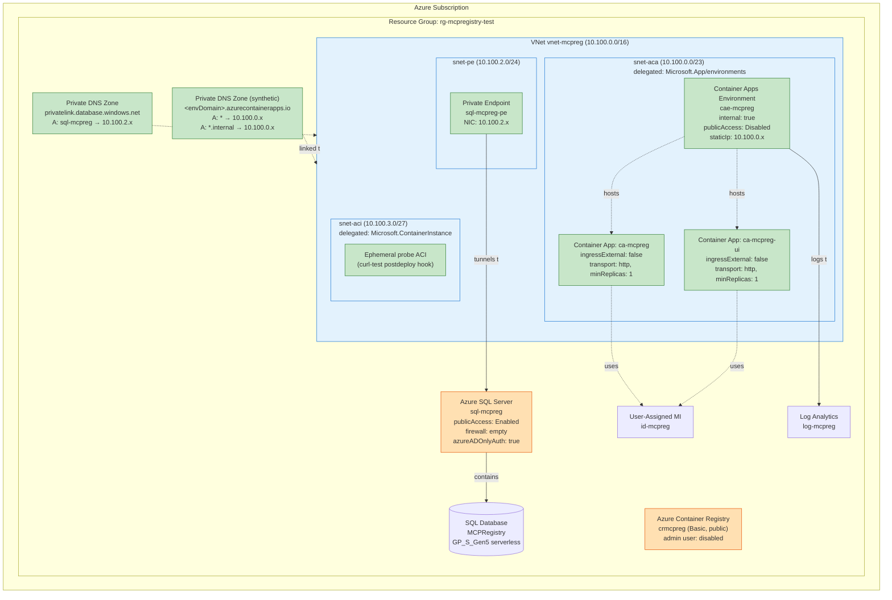
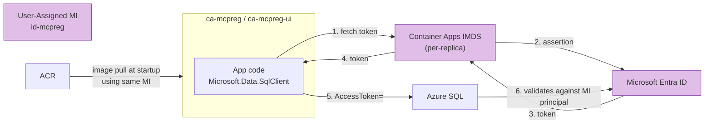
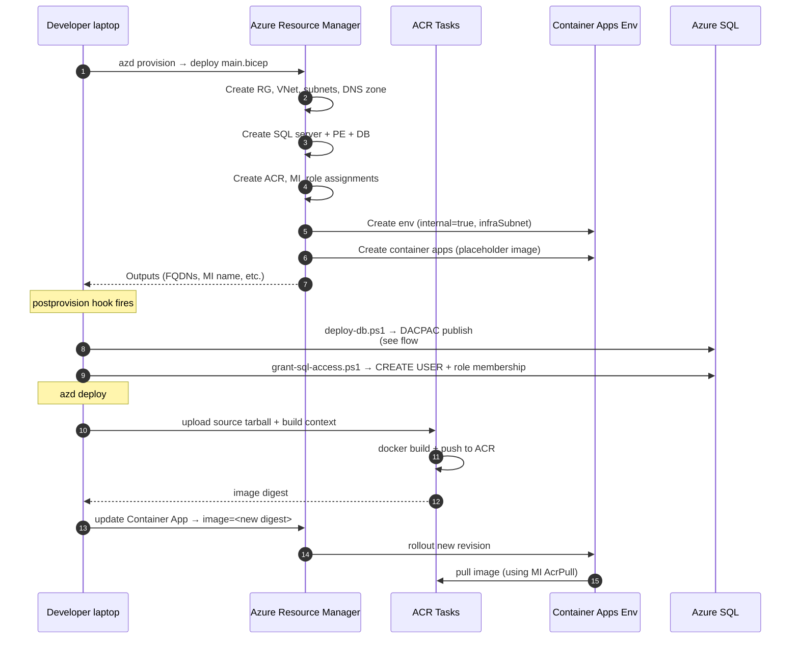
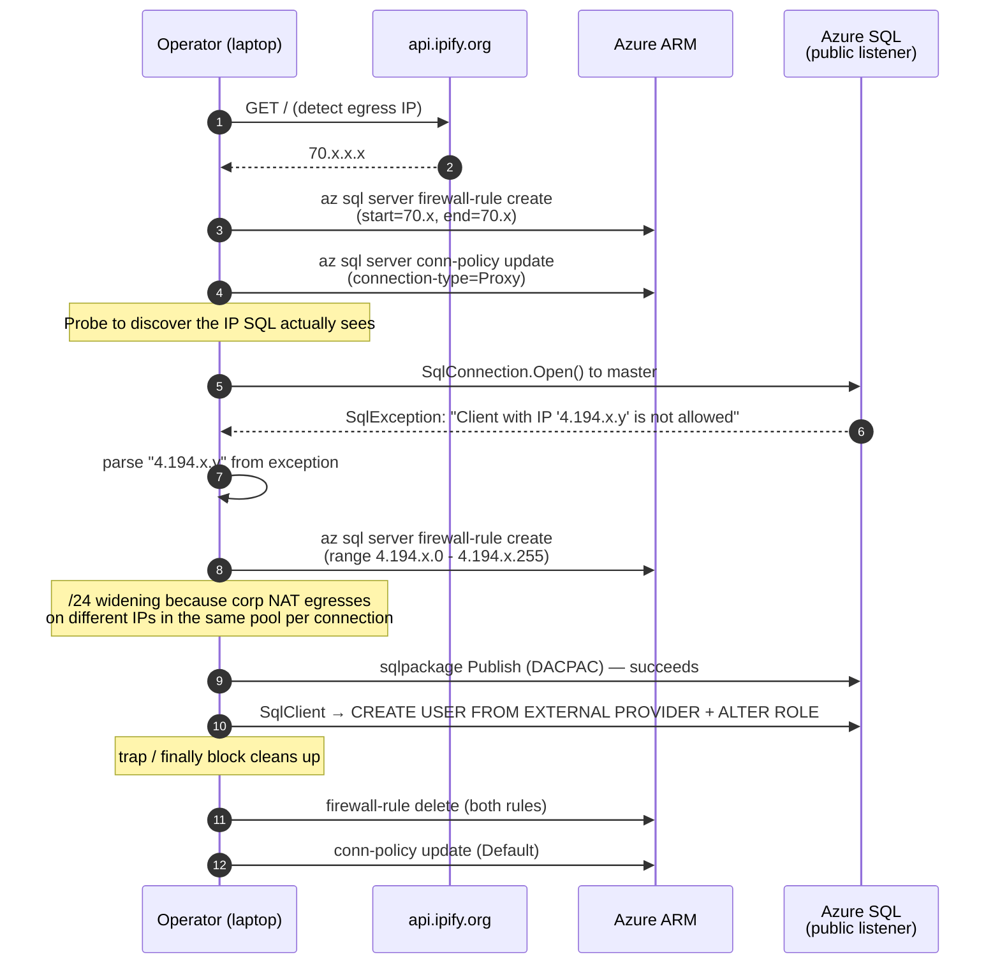
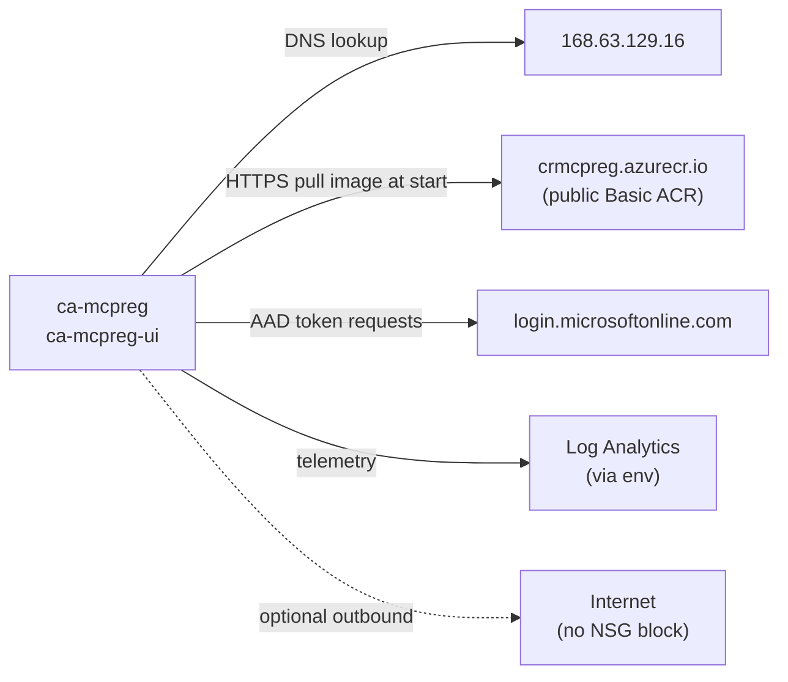

# MCP Registry — Locked-Down Architecture

This document describes the production network architecture for the MCP Registry deployment after lockdown. It covers the VNet topology, all traffic flows (data-plane, control-plane, management, and DNS), identity and auth, and operator/deployment paths.

The architecture is implemented in [azd/infra/main.bicep](../azd/infra/main.bicep), [azd/infra/modules/network.bicep](../azd/infra/modules/network.bicep), [azd/infra/modules/resources.bicep](../azd/infra/modules/resources.bicep), and [azd/infra/modules/aca-dns.bicep](../azd/infra/modules/aca-dns.bicep).

> **Known limitation — platform bug.** As of 2026-05-17 the internal Container Apps load balancer in this design returns `404 Container App is stopped or does not exist` for healthy replicas in centralus (and northeurope per [microsoft/azure-container-apps#1714](https://github.com/microsoft/azure-container-apps/issues/1714)). The bug affects `internal: true` Workload Profiles envs and is acknowledged by Microsoft. Two production-ready workarounds are documented as drop-in alternatives:
> - [docs/architecture-option-a.md](architecture-option-a.md) — External env + `publicNetworkAccess: Disabled` + Private Endpoint (MS-documented fully-private pattern).
> - [docs/architecture-option-b.md](architecture-option-b.md) — External env + per-app `ipSecurityRestrictions` allowlist of the VNet CIDR.

---

## Design goals

- **No public ingress to the application.** The API and UI are reachable only from inside the VNet (or a future peered network).
- **No public data plane to the database.** Application → SQL traffic flows over a private endpoint inside the VNet.
- **No SQL passwords anywhere.** All authentication is Microsoft Entra ID (`disableLocalAuth: true`, `azureADOnlyAuthentication: true`). The application uses a user-assigned managed identity.
- **Operator-friendly.** Schema deployment (DACPAC) and SQL grant scripts continue to work from a developer laptop without a VPN. SQL keeps a public listener with **empty firewall rules**; the postprovision scripts add a temporary, narrow rule and remove it on exit.
- **No additional cost for ingress hardening.** No App Gateway, no Premium ACR, no Bastion. Inbound access is added later via VNet peering when needed.

---

## Resource inventory & lockdown state

| Resource | Type | Public access | Notes |
|---|---|---|---|
| `vnet-mcpreg-<suffix>` | Virtual Network (10.100.0.0/16) | n/a | Three subnets: `snet-aca` (10.100.0.0/23, delegated to `Microsoft.App/environments`), `snet-pe` (10.100.2.0/24), `snet-aci` (10.100.3.0/27, delegated to `Microsoft.ContainerInstance/containerGroups`) |
| `cae-mcpreg-<suffix>` | Container Apps Environment | **Disabled** | `internal: true`, `infrastructureSubnetResourceId = snet-aca`, `publicNetworkAccess: Disabled`, `workloadProfiles: [Consumption]`. App ingress: `ingressTransport: 'http'`, `scaleSettings.minReplicas: 1` (keeps at least one warm replica so L7 routes are always registered). |
| `ca-mcpreg-<suffix>` | Container App (API) | **Internal only** | `ingressExternal: false`, FQDN `ca-mcpreg-<suffix>.internal.<envDomain>` |
| `ca-mcpreg-ui-<suffix>` | Container App (UI) | **Internal only** | Same as above |
| `sql-mcpreg-<suffix>` | Azure SQL Server | **Enabled (firewall = empty)** | Private endpoint `sql-mcpreg-<suffix>-pe` in `snet-pe`. Public listener exists but rejects all clients unless a temporary firewall rule is added. |
| `MCPRegistry` | SQL Database (Serverless GP_S_Gen5) | n/a | Auto-pause 60 min, 0.5–2 vCore |
| `crmcpreg<suffix>` | Container Registry | **Public (Basic SKU)** | Access controlled by managed identity AcrPull (no admin user) |
| `id-mcpreg-<suffix>` | User-Assigned Managed Identity | n/a | Used by both Container Apps for ACR pulls and SQL data-plane auth |
| `log-mcpreg-<suffix>` | Log Analytics Workspace | n/a | Receives `appLogsConfiguration` from the env |
| `privatelink.database.windows.net` | Private DNS Zone | n/a | Linked to the VNet; A record auto-bound to the SQL PE NIC |
| `<envDomain>` (e.g. `happybush-ccbedd39.centralus.azurecontainerapps.io`) | Private DNS Zone (synthetic) | n/a | Built by [azd/infra/modules/aca-dns.bicep](../azd/infra/modules/aca-dns.bicep). Wildcard A records `*` and `*.internal` both → env `staticIp` (10.100.0.x). Linked to `vnet-mcpreg`. Required so in-VNet clients resolve `<app>.internal.<envDomain>` to the env's internal LB instead of falling through to public DNS. |

---

## Network topology



Green = private-only. Orange = has a public listener (intentionally). Blue = network containers.

---

## Traffic flow #1 — UI request from inside the VNet

This is the **only** path that reaches the running application. The UI is unreachable from the public internet.

```mermaid
sequenceDiagram
    autonumber
    participant Client as Client<br/>(in-VNet or peered VNet)
    participant DNS as Azure-provided DNS<br/>(168.63.129.16)
    participant ZoneAca as Private DNS Zone<br/>&lt;envDomain&gt;<br/>(synthetic, wildcards)
    participant Env as Container Apps Env<br/>internal LB (staticIp)
    participant UI as ca-mcpreg-ui<br/>(Blazor Server)
    participant API as ca-mcpreg<br/>(REST API)
    participant ZoneSql as privatelink.database<br/>.windows.net
    participant PE as SQL Private Endpoint<br/>(10.100.2.x)
    participant SQL as Azure SQL Database<br/>MCPRegistry

    Client->>DNS: Resolve ca-mcpreg-ui.internal.<envDomain>
    DNS->>ZoneAca: VNet-linked private zone hit<br/>(*.internal wildcard)
    ZoneAca-->>DNS: A 10.100.0.x (env staticIp)
    DNS-->>Client: 10.100.0.x
    Client->>Env: HTTPS :443
    Env->>UI: route by Host header to UI replica
    UI->>DNS: Resolve ca-mcpreg.internal.<envDomain>
    DNS->>ZoneAca: same zone hit
    ZoneAca-->>DNS: A 10.100.0.x (same staticIp)
    DNS-->>UI: 10.100.0.x
    UI->>Env: HTTPS :443 internal call
    Env->>API: route to API replica
    API->>DNS: Resolve sql-mcpreg.database.windows.net
    DNS->>ZoneSql: VNet-linked private zone hit
    ZoneSql-->>DNS: CNAME → A 10.100.2.x
    DNS-->>API: 10.100.2.x
    API->>PE: TCP 1433 + TLS
    PE->>SQL: tunneled to SQL gateway
    SQL-->>API: query results
    API-->>UI: JSON response
    UI-->>Client: rendered HTML
```

Key points:
- All hops stay inside the VNet. No traffic egresses to the internet (except outbound — see flow #5).
- The env's internal FQDN `<app>.internal.<envDomain>` is **not** resolvable in public DNS — the synthetic private DNS zone created by [aca-dns.bicep](../azd/infra/modules/aca-dns.bicep) provides the wildcard `*.internal` A record that points every app FQDN at the env's internal LB `staticIp`.
- DNS for the SQL FQDN resolves to the **private endpoint NIC**, not the public IP, because the `privatelink.database.windows.net` zone is linked to the VNet.
- Inter-app calls (UI → API) hit the env's internal LB by FQDN — the env routes by `Host` header to the right app.

---

## Traffic flow #2 — Identity / authentication

Both Container Apps use a **single user-assigned managed identity** for all credentials.



How auth is wired:
- The connection string (set on each Container App) contains `Authentication=Active Directory Default;User Id=<MI client ID>` — no password. `Microsoft.Data.SqlClient` calls IMDS to get a token scoped to `https://database.windows.net/`.
- The MI was added as a SQL principal by [azd/scripts/grant-sql-access.ps1](../azd/scripts/grant-sql-access.ps1) with `db_datareader` + `db_datawriter` membership.
- The same MI also has `AcrPull` on the registry, used at container start to pull images.
- Sign-in to SQL is gated by `azureADOnlyAuthentication: true` — no SQL logins are accepted, ever.

---

## Traffic flow #3 — `azd up` provisioning (control plane, from operator laptop)



All operator traffic is to the Azure ARM control plane (public, AAD-authenticated). The operator never needs network reachability into the VNet.

---

## Traffic flow #4 — Postprovision DACPAC and grant scripts (data plane, from laptop)

This is the trickiest piece. SQL is locked down (private endpoint, empty firewall) but the operator needs to publish the schema and grant the MI access **from outside the VNet**. The pattern:



Why a /24 and not the single probe IP: the corporate NAT pool used to reach SQL spans an entire /24, and *each connection* may egress on a different IP within that range. The /24 covers the pool; the rule lives only for the duration of the operation.

Why connection-policy = Proxy: the default (Redirect) sends the client to a backend node port directly; it requires a client TLS handshake against an unpredictable IP. Proxy keeps everything on the gateway and works through corporate firewalls more reliably.

The implementation lives in [azd/scripts/deploy-db.ps1](../azd/scripts/deploy-db.ps1) and [azd/scripts/grant-sql-access.ps1](../azd/scripts/grant-sql-access.ps1) (and `.sh` equivalents).

---

## Traffic flow #5 — App outbound to internet

The Container Apps env is `internal: true` — that controls **inbound** only. Outbound traffic from the apps still leaves through the env's egress.



The env does **not** block outbound. If outbound restriction is needed later, attach an NSG with `Internet` deny + service-tag allows for `AzureContainerRegistry`, `AzureActiveDirectory`, `AzureMonitor`, `Storage` to `snet-aca`.

---

## Reachability matrix

| Source | API ingress | UI ingress | SQL data plane | ACR | Azure ARM (mgmt) |
|---|---|---|---|---|---|
| Public internet | ❌ blocked | ❌ blocked | ❌ rejected (firewall = empty) | ✅ public | ✅ public, AAD-auth |
| Inside `vnet-mcpreg` (in-env replicas, ACI in `snet-aci`) | ✅ via internal LB (currently degraded — see platform bug callout at top) | ✅ via internal LB (same caveat) | ✅ via PE | ✅ public + MI auth | n/a |
| Peered VNet (when configured) | ✅ if env DNS zone is also linked to the peer (see "Adding inbound access") | ✅ same | ✅ via PE (DNS zone link is auto-extended by network module) | ✅ public | ✅ |
| Operator laptop | ❌ | ❌ | ✅ during postprovision script run only (temp /24 firewall rule) | ✅ public via az push | ✅ |

---

## Adding inbound access (optional, post-deploy)

The lockdown ships with **no** public ingress path. To add reachability without losing isolation:

1. **Peer a hub or dev VNet:**
   ```powershell
   azd env set AZURE_PEER_VNET_RESOURCE_ID /subscriptions/<sub>/resourceGroups/<rg>/providers/Microsoft.Network/virtualNetworks/<name>
   azd provision
   ```
   This adds a one-sided peering and auto-links the SQL private DNS zone to the peer. **You must manually create the reverse peering** in the peer VNet's resource group.

2. **Link the synthetic ACA env private DNS zone to the peer VNet.** The local link is created automatically by [aca-dns.bicep](../azd/infra/modules/aca-dns.bicep) (`link-self`); the peer link is **not** — it's left manual because the peer's resource ID is only known at deploy time and may live in a different subscription. Either:
   ```powershell
   $zoneId = az network private-dns zone show -g <rg> -n <envDomain> --query id -o tsv
   az network private-dns link vnet create -g <rg> -z <envDomain> -n peer-link `
     --virtual-network <peerVnetResourceId> --registration-enabled false
   ```
   or extend `aca-dns.bicep` with a second conditional `virtualNetworkLinks` resource gated on `peerVnetResourceId` (same shape as the SQL `sqlDnsLinkPeer` in [network.bicep](../azd/infra/modules/network.bicep)).

3. For human access from outside the peer, add **one** of:
   - Azure VPN Gateway / Bastion in the peer VNet
   - Application Gateway with private backend pool in `snet-pe` (re-exposes the app publicly with WAF — opposite of the current lockdown)
   - Azure Front Door + Private Link service (similar trade-off)

---

## Known gaps and possible future hardening

- **Microsoft platform bug blocks L7 routing in this design.** See the callout at the top of this document. As deployed today, in-VNet clients can resolve and TCP-connect to the env's internal LB, but the env L7 returns 404 for every request — including the official MS hello-world sample. Production deployments should pick [Option A](architecture-option-a.md) (PE-only) or [Option B](architecture-option-b.md) (external + IP allowlist) until [microsoft/azure-container-apps#1714](https://github.com/microsoft/azure-container-apps/issues/1714) is resolved.
- **ACR is public.** Upgrade to Premium + private endpoint to remove the public attack surface (~$160/mo extra; also requires `azd` to run inside the VNet to push). Current mitigation: managed identity AcrPull only, admin user disabled.
- **SQL public listener stays on** for operator convenience. To fully disable: set `publicNetworkAccess: 'Disabled'` and run all postprovision scripts from inside the VNet (e.g., a Container Apps Job, or a temporary VM/Bastion).
- **No NSG on the subnets.** Outbound is wide open. Add an NSG to `snet-aca` if egress filtering is required.
- **No diagnostic settings on every resource.** Only the Container Apps env logs to Log Analytics today. Wire up SQL audit, ACR diagnostic, and VNet flow logs as needed.
- **Single region.** No DR/multi-region. Add a paired-region deployment if RTO/RPO requirements emerge.
- **Synthetic env DNS zone is region-and-env-bound.** The zone name is the env's `defaultDomain`, which Azure generates at env-create time and which changes if the env is recreated. The Bicep handles this automatically via [aca-dns.bicep](../azd/infra/modules/aca-dns.bicep), but any externally-maintained DNS forwarding rules (e.g., on a corporate DNS) would need to be updated after an env recreate.
